# PHÂN TÍCH CODE FLOW - RAGFlow

Tài liệu này mô tả chi tiết luồng xử lý code của hệ thống RAGFlow, từ input đến output, bao gồm sequence diagrams cho từng module chính.

---

## 📋 MỤC LỤC

1. [Tổng Quan Kiến Trúc](#1-tổng-quan-kiến-trúc)
2. [Entry Points & Bootstrap](#2-entry-points--bootstrap)
3. [Request Flow Tổng Quan](#3-request-flow-tổng-quan)
4. [Module 1: Document Upload & Processing](#4-module-1-document-upload--processing)
5. [Module 2: RAG Retrieval System](#5-module-2-rag-retrieval-system)
6. [Module 3: Chat/Conversation Flow](#6-module-3-chatconversation-flow)
7. [Module 4: Agent/Workflow Execution](#7-module-4-agentworkflow-execution)
8. [Hướng Dẫn Đọc Code Hiệu Quả](#8-hướng-dẫn-đọc-code-hiệu-quả)

---

## 1. Tổng Quan Kiến Trúc

RAGFlow sử dụng kiến trúc microservices với các thành phần chính:

```
┌─────────────────────────────────────────────────────────┐
│                    RAGFlow Architecture                  │
├─────────────────────────────────────────────────────────┤
│                                                          │
│  ┌──────────────┐        ┌──────────────┐              │
│  │   Frontend   │───────▶│  API Server  │              │
│  │  (React/TS)  │        │   (Quart)    │              │
│  └──────────────┘        └──────┬───────┘              │
│                                  │                       │
│                    ┌─────────────┼─────────────┐        │
│                    ▼             ▼             ▼        │
│            ┌───────────┐  ┌───────────┐  ┌──────────┐  │
│            │  Service  │  │   RAG     │  │  Agent   │  │
│            │   Layer   │  │  Engine   │  │  System  │  │
│            └─────┬─────┘  └─────┬─────┘  └────┬─────┘  │
│                  │              │              │        │
│                  └──────────────┼──────────────┘        │
│                                 ▼                       │
│                    ┌────────────────────────┐           │
│                    │   Data Layer           │           │
│                    ├────────────────────────┤           │
│                    │ MySQL/PostgreSQL       │           │
│                    │ Elasticsearch/Infinity │           │
│                    │ Redis                  │           │
│                    │ MinIO/S3               │           │
│                    └────────────────────────┘           │
│                                                          │
└─────────────────────────────────────────────────────────┘
```

### Các Lớp Chính:

| Lớp | Thư mục | Chức năng |
|-----|---------|-----------|
| **API Layer** | `api/apps/` | HTTP request handlers, routing |
| **Service Layer** | `api/db/services/` | Business logic, orchestration |
| **RAG Engine** | `rag/` | Document processing, retrieval |
| **Agent System** | `agent/` | Workflow execution |
| **Data Models** | `api/db/db_models.py` | Database schema |

---

## 2. Entry Points & Bootstrap

### 2.1. Main Server Entry Point

**File:** `api/ragflow_server.py`

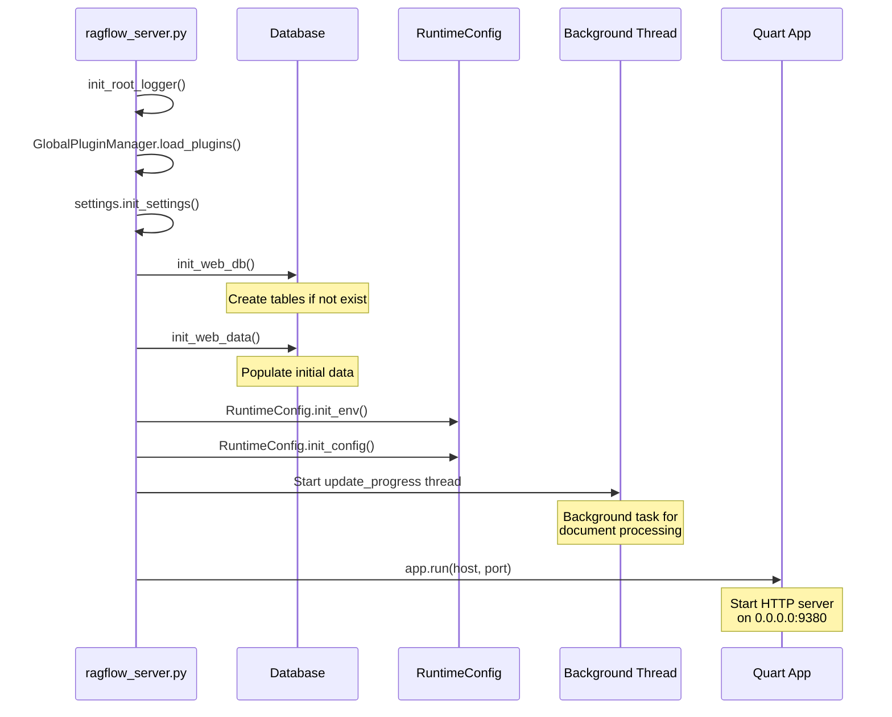

**Các bước khởi tạo:**

1. **Logging Setup** - Khởi tạo logging system
2. **Plugin Loading** - Load các plugins từ plugin manager
3. **Settings Init** - Khởi tạo cấu hình từ environment variables
4. **Database Init** - Tạo tables và populate dữ liệu ban đầu
5. **Runtime Config** - Khởi tạo runtime configuration
6. **Background Tasks** - Start background thread để theo dõi document processing
7. **SMTP Setup** - Cấu hình email server (nếu có)
8. **HTTP Server** - Start Quart application

### 2.2. Flask/Quart Application Setup

**File:** `api/apps/__init__.py`

```python
# Key initialization
app = Quart(__name__)
app = cors(app, allow_origin="*")

# Auto-discover and register blueprints
pages_dir = [
    Path(__file__).parent,                      # api/apps/
    Path(__file__).parent / "sdk",              # api/apps/sdk/
]

# Register all *_app.py files as blueprints
for path in search_pages_path(pages_dir):
    register_page(path)  # /{API_VERSION}/{page_name}
```

**Blueprint Registration Pattern:**
- Tất cả file `*_app.py` trong `api/apps/` được tự động register
- URL prefix: `/{API_VERSION}/{module_name}`
- SDK endpoints: `/api/{API_VERSION}`

---

## 3. Request Flow Tổng Quan

### 3.1. HTTP Request Lifecycle

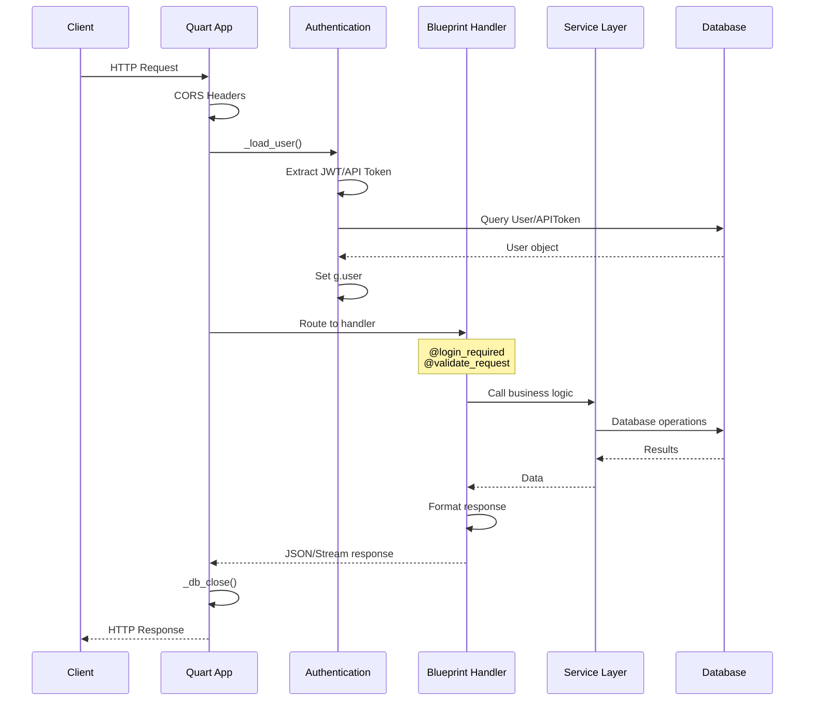

### 3.2. Authentication Flow

**File:** `api/apps/__init__.py:105-141`

```python
def _load_user():
    jwt = Serializer(secret_key=settings.SECRET_KEY)
    authorization = request.headers.get("Authorization")

    # Try JWT token first
    access_token = str(jwt.loads(authorization))
    user = UserService.query(access_token=access_token)

    # Fallback to API token
    if not user:
        objs = APIToken.query(token=authorization.split()[1])
        if objs:
            user = UserService.query(id=objs[0].tenant_id)

    if user:
        g.user = user[0]
        return user[0]
```

**2 loại authentication:**
1. **JWT Token** - User sessions (web/mobile)
2. **API Token** - Service-to-service calls

---

## 4. Module 1: Document Upload & Processing

### 4.1. Upload Flow - Tổng Quan

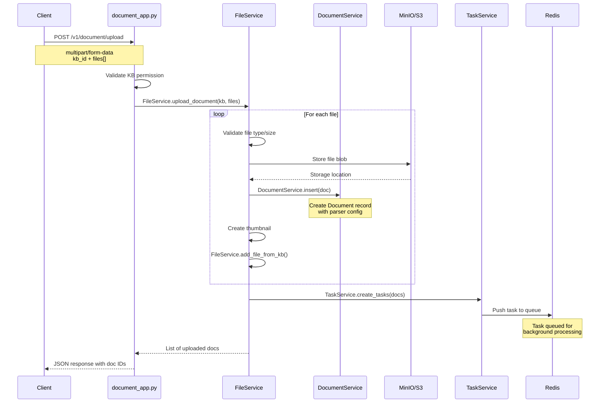

### 4.2. File Validation & Storage

**File:** `api/db/services/file_service.py`

**Validation Steps:**
1. Check file type against `VALID_FILE_TYPES`
2. Check file name length (≤ 255 bytes)
3. Check file size limits
4. Check KB permissions

**Supported File Types:**
```python
VALID_FILE_TYPES = {
    "pdf", "docx", "doc", "txt", "md", "json",
    "ppt", "pptx", "pages",
    "xls", "xlsx", "csv",
    "jpg", "jpeg", "png", "gif", "bmp", "tiff",
    "mp3", "wav", "m4a",
    "eml", "msg",
}
```

### 4.3. Background Task Processing

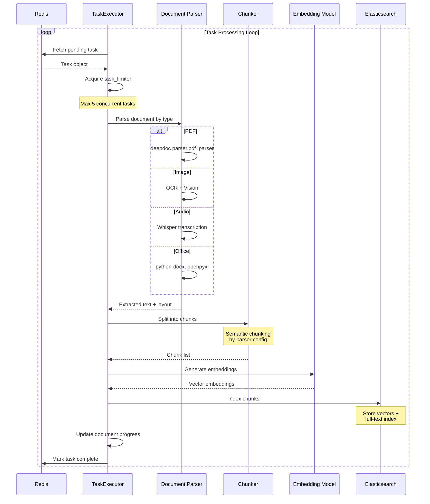

**File:** `rag/svr/task_executor.py`

**Concurrency Control:**
```python
task_limiter = trio.Semaphore(5)       # Max 5 concurrent tasks
chunk_limiter = trio.CapacityLimiter(1) # Max 1 concurrent chunker
embed_limiter = trio.CapacityLimiter(1) # Max 1 concurrent embedder
```

### 4.4. Document Parsing Pipeline

**File:** `rag/app/` (various parsers)

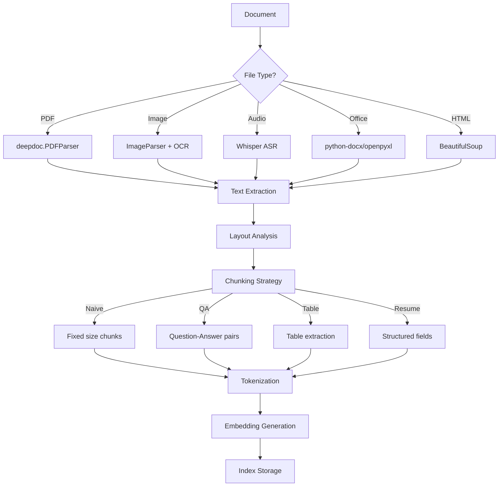

**Parser Types:**
```python
class ParserType(str, Enum):
    NAIVE = "naive"          # Generic documents
    PAPER = "paper"          # Academic papers
    BOOK = "book"            # Books/eBooks
    PRESENTATION = "presentation"  # PPT
    MANUAL = "manual"        # Technical manuals
    QA = "qa"               # Q&A format
    TABLE = "table"         # Spreadsheets
    RESUME = "resume"       # Resumes/CVs
    PICTURE = "picture"     # Images
    AUDIO = "audio"         # Audio files
    EMAIL = "email"         # Emails
```

### 4.5. Task Progress Tracking

**File:** `api/db/services/document_service.py:update_progress()`

```python
def update_progress():
    """Background thread to update document processing progress"""
    while not stop_event.is_set():
        # Get all running tasks
        tasks = TaskService.query(status=TaskStatus.RUNNING)

        for task in tasks:
            # Update progress from task executor
            doc = DocumentService.get_by_id(task.doc_id)
            doc.progress = task.progress
            doc.progress_msg = task.progress_msg
            DocumentService.update_by_id(doc.id, doc)

        time.sleep(6)  # Update every 6 seconds
```

---

## 5. Module 2: RAG Retrieval System

### 5.1. Retrieval Flow - Overview

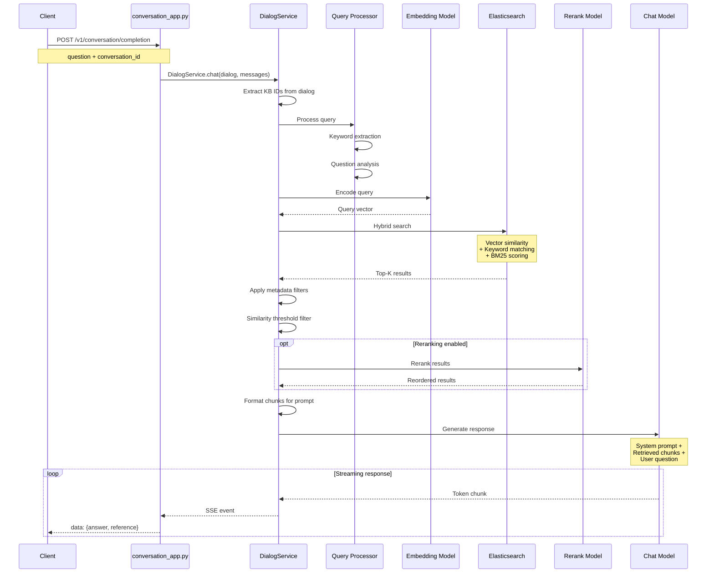

### 5.2. Query Processing

**File:** `rag/nlp/query.py`

```python
class FulltextQueryer:
    def question(self, txt: str, min_match: str = "30%") -> tuple:
        """
        Extract keywords and build Elasticsearch query

        Returns:
            (keywords, should_query, minimum_should_match)
        """
        # Tokenization
        tokens = self.tokenizer.tokenize(txt)
        keywords = " ".join(tokens)

        # Build should clauses for BM25
        should = [
            {"term": {"title_tks": {"value": t, "boost": 8}}},
            {"term": {"content_tks": {"value": t}}},
        ]

        return keywords, {"should": should}, min_match
```

### 5.3. Hybrid Search Architecture

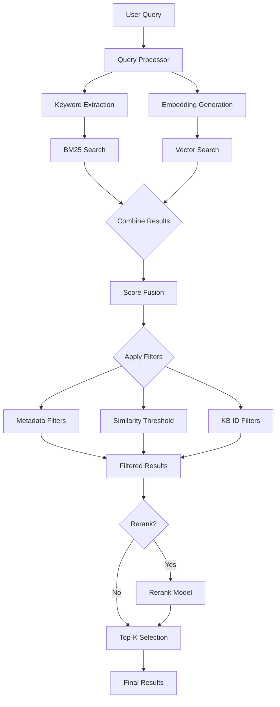

**Score Fusion Formula:**
```python
final_score = (
    vector_similarity * vector_weight +
    bm25_score * (1 - vector_weight)
)

# Default weights
vector_weight = 0.3  # Configurable in Dialog settings
```

### 5.4. Elasticsearch Query Structure

**File:** `rag/nlp/search.py`

```python
def search(self, query_vector, kb_ids, query_text, top_k=10):
    """
    Hybrid search combining vector and full-text
    """
    es_query = {
        "query": {
            "bool": {
                "must": [
                    # KB filter
                    {"terms": {"kb_id": kb_ids}},
                    # Available documents only
                    {"term": {"available_int": 1}}
                ],
                "should": [
                    # Vector similarity
                    {
                        "script_score": {
                            "query": {"match_all": {}},
                            "script": {
                                "source": "cosineSimilarity(params.query_vector, 'q_vec') + 1.0",
                                "params": {"query_vector": query_vector}
                            }
                        }
                    },
                    # BM25 full-text
                    {
                        "multi_match": {
                            "query": query_text,
                            "fields": ["content_tks^1", "title_tks^8"],
                            "type": "best_fields"
                        }
                    }
                ]
            }
        },
        "size": top_k
    }

    return self.es_client.search(index=index_name, body=es_query)
```

### 5.5. Reranking (Optional)

**File:** `rag/llm/rerank_model.py`

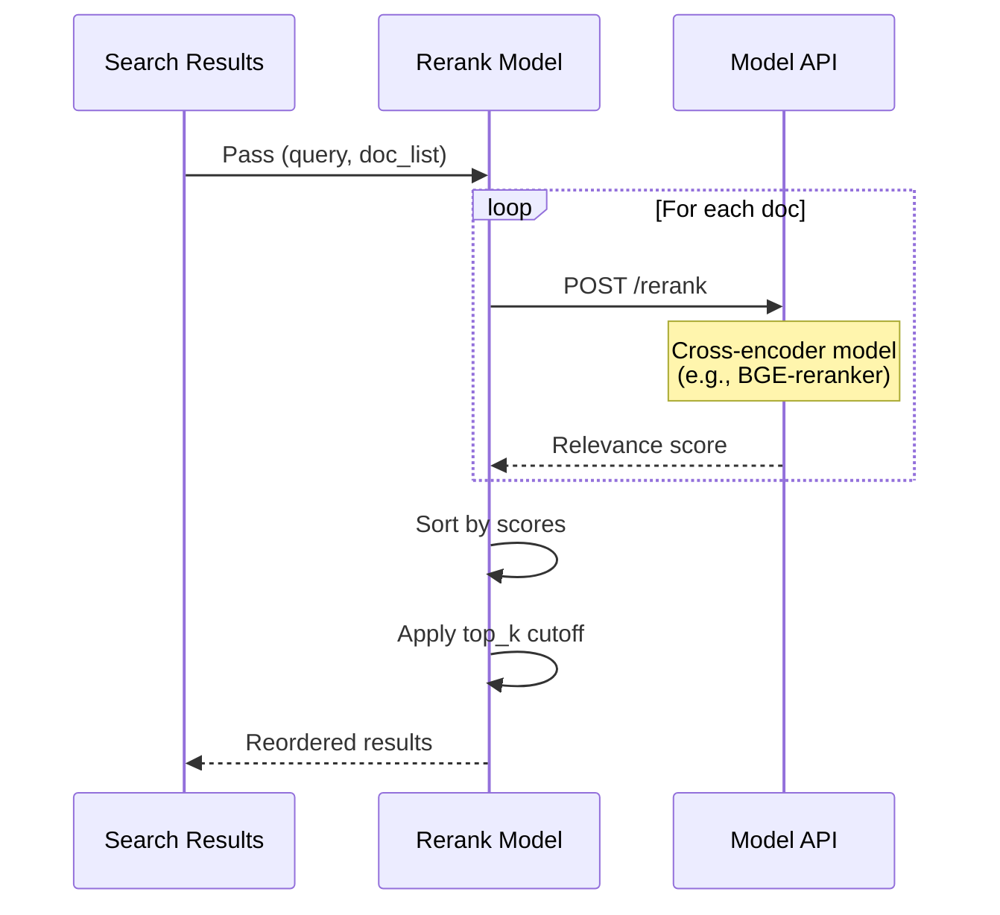

**Supported Rerank Models:**
- BGE Reranker (Chinese/English)
- Cohere Rerank
- Jina Reranker
- Custom rerank endpoints

---

## 6. Module 3: Chat/Conversation Flow

### 6.1. Complete Chat Flow

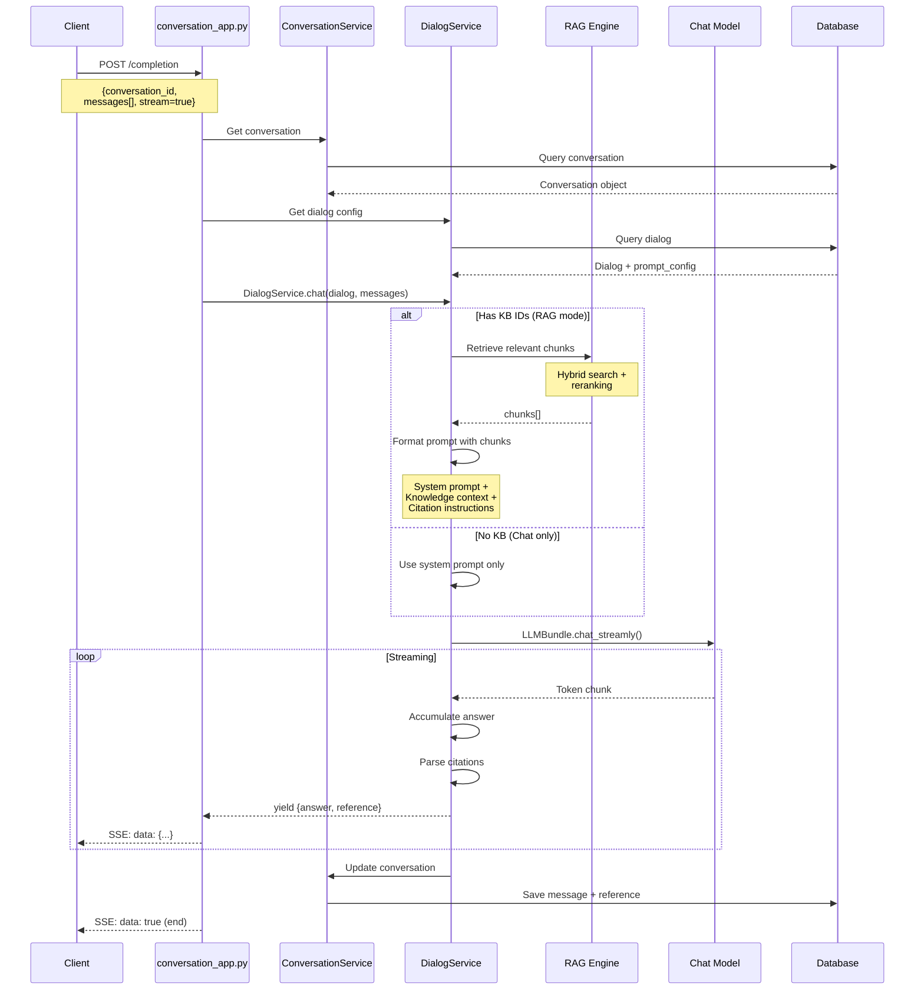

### 6.2. Prompt Construction

**File:** `rag/prompts/generator.py`

```python
def construct_prompt(question, chunks, dialog):
    """
    Build the final prompt with retrieved knowledge
    """
    prompt_config = dialog.prompt_config

    # 1. System prompt
    system = prompt_config.get("system", DEFAULT_SYSTEM_PROMPT)

    # 2. Knowledge context
    if chunks:
        knowledge = kb_prompt(chunks)
        # Format: "Here's the knowledge:\n[ID:0] content1\n[ID:1] content2..."

    # 3. Citation instructions
    citation = citation_prompt()
    # "Please cite sources using [ID:N] format"

    # 4. Cross-language handling
    if dialog.language != "English":
        system += cross_languages(dialog.language)

    # 5. Full question with context
    full_q = full_question(question, conv_history)

    # 6. Assemble final prompt
    final_prompt = f"""
{system}

{knowledge}

{citation}

User: {full_q}
Assistant:
"""

    return final_prompt
```

### 6.3. Prompt Templates

**File:** `rag/prompts/` (Jinja2 templates)

**System Prompt Example:**
```jinja2
You are an intelligent assistant. Please summarize the content of the knowledge base to answer the question. Please keep your answer under {{max_tokens}} tokens. Please list the data sources in the knowledge base at the end of your answer.


Here is the knowledge base:

[ID:{{loop.index0}}] {{chunk.content}}



The above is the knowledge base. Please answer the question: {{question}}
```

### 6.4. Citation Parsing

**File:** `api/db/services/dialog_service.py:repair_bad_citation_formats()`

```python
# Supported citation formats
CITATION_PATTERNS = [
    r"\[ID: ?(\d+)\]",      # [ID:0], [ID: 1]
    r"【ID: ?(\d+)】",       # 【ID:0】
    r"\(ID: ?(\d+)\)",      # (ID:0)
    r"ref ?(\d+)",          # ref0, REF 1
]

def parse_citations(answer, chunks):
    """Extract citation indices from answer"""
    cited_chunks = set()

    for pattern in CITATION_PATTERNS:
        matches = re.finditer(pattern, answer, re.IGNORECASE)
        for match in matches:
            idx = int(match.group(1))
            if 0 <= idx < len(chunks):
                cited_chunks.add(idx)

    # Return only cited chunks
    return [chunks[i] for i in sorted(cited_chunks)]
```

### 6.5. Streaming Response Format

**SSE (Server-Sent Events) Format:**

```javascript
// Incremental answer updates
data: {
  "code": 0,
  "message": "",
  "data": {
    "answer": "Partial answer text...",
    "reference": {
      "chunks": [...],      // Cited chunks
      "doc_aggs": [...]     // Document metadata
    },
    "prompt": "",
    "audio_binary": null,
    "created_at": 1234567890
  }
}

// End of stream
data: {
  "code": 0,
  "message": "",
  "data": true
}
```

### 6.6. Conversation State Management

**Database Schema:**

```python
class Conversation(Model):
    id = CharField(primary_key=True)
    dialog_id = CharField()              # Link to Dialog config
    name = CharField()                   # Conversation title
    message = JSONField()                # Message history
    reference = JSONField()              # Retrieved chunks per turn
    user_id = CharField()
    create_time = BigIntegerField()
    update_time = BigIntegerField()
```

**Message Format:**
```json
{
  "message": [
    {
      "role": "assistant",
      "content": "How can I help you?"
    },
    {
      "role": "user",
      "content": "What is RAG?",
      "id": "msg_123"
    },
    {
      "role": "assistant",
      "content": "RAG stands for Retrieval-Augmented Generation[ID:0]...",
      "id": "msg_123"
    }
  ],
  "reference": [
    {},  // Empty for prologue
    {
      "chunks": [...],      // Chunks for first Q&A
      "doc_aggs": [...]
    }
  ]
}
```

---

## 7. Module 4: Agent/Workflow Execution

### 7.1. Agent Architecture Overview

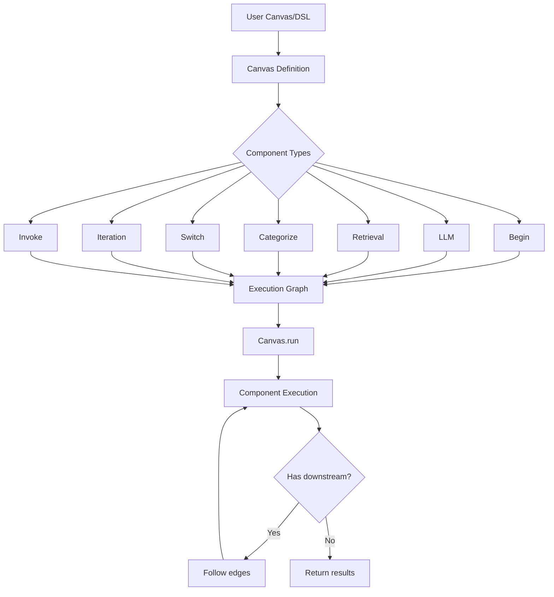

### 7.2. Canvas Execution Flow

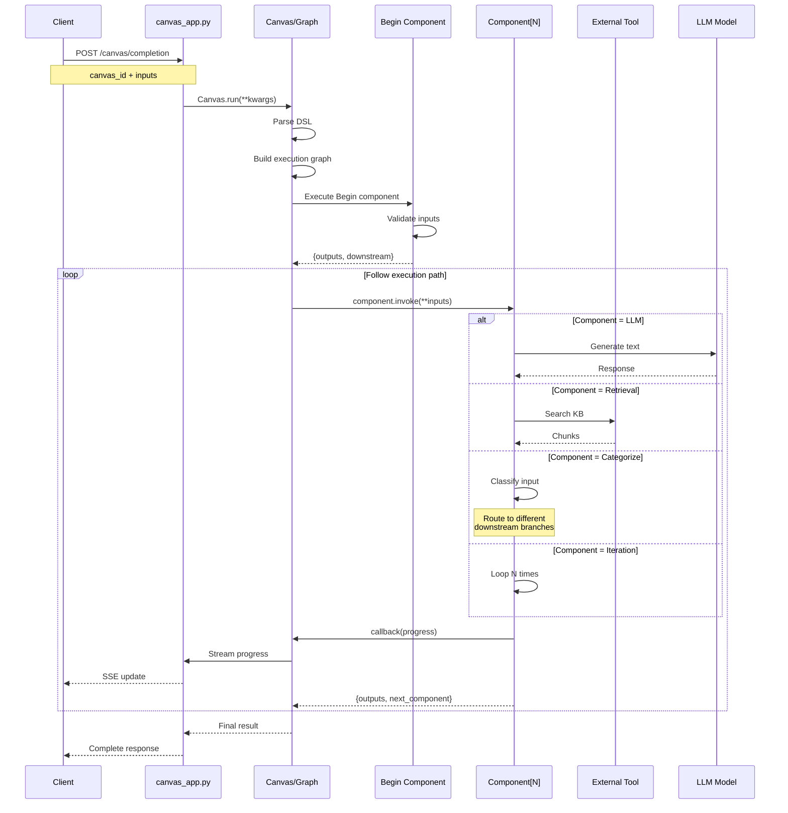

### 7.3. Canvas DSL Structure

**File:** `agent/canvas.py`

```python
# Canvas DSL format
{
    "components": {
        "begin": {
            "obj": {
                "component_name": "Begin",
                "params": {}
            },
            "downstream": ["llm_0"],
            "upstream": []
        },
        "llm_0": {
            "obj": {
                "component_name": "LLM",
                "params": {
                    "llm_id": "gpt-4",
                    "prompt": "You are a helpful assistant",
                    "temperature": 0.7
                }
            },
            "downstream": ["retrieval_0"],
            "upstream": ["begin"]
        },
        "retrieval_0": {
            "obj": {
                "component_name": "Retrieval",
                "params": {
                    "kb_ids": ["kb_123"],
                    "similarity_threshold": 0.2,
                    "top_k": 3
                }
            },
            "downstream": ["answer"],
            "upstream": ["llm_0"]
        },
        "answer": {
            "obj": {
                "component_name": "Answer",
                "params": {}
            },
            "downstream": [],
            "upstream": ["retrieval_0"]
        }
    },
    "path": ["begin"],  // Execution path
    "globals": {
        "sys.query": "",
        "sys.user_id": "",
        "sys.conversation_turns": 0
    }
}
```

### 7.4. Component Base Class

**File:** `agent/component/base.py`

```python
class ComponentBase:
    def __init__(self, canvas, component_id, component_obj):
        self.canvas = canvas
        self.id = component_id
        self.params = component_obj.get("params", {})

    async def invoke(self, **kwargs):
        """
        Execute component logic

        Args:
            **kwargs: Inputs from upstream components

        Returns:
            dict: {
                "output": ...,       # Component output
                "downstream": [...], # Next components to execute
            }
        """
        raise NotImplementedError

    def callback(self, message, progress=0.0):
        """Report progress to user"""
        self.canvas.on_progress(self.id, message, progress)
```

### 7.5. Key Component Types

**1. LLM Component**

```python
# agent/component/llm.py
class LLM(ComponentBase):
    async def invoke(self, **kwargs):
        prompt = self.render_prompt(self.params["prompt"], kwargs)

        llm = LLMBundle(
            tenant_id=self.canvas.tenant_id,
            llm_type=LLMType.CHAT,
            llm_id=self.params["llm_id"]
        )

        if self.params.get("stream"):
            for chunk in llm.chat_streamly(prompt, **gen_conf):
                self.callback(chunk, progress)
                yield chunk
        else:
            result = llm.chat(prompt, **gen_conf)
            return {"output": result}
```

**2. Retrieval Component**

```python
# agent/component/retrieval.py
class Retrieval(ComponentBase):
    async def invoke(self, query, **kwargs):
        # Use DialogService.ask for retrieval
        chunks = []
        for ans in ask(
            question=query,
            kb_ids=self.params["kb_ids"],
            tenant_id=self.canvas.tenant_id,
            top_k=self.params.get("top_k", 5)
        ):
            chunks = ans.get("reference", {}).get("chunks", [])

        return {
            "chunks": chunks,
            "output": chunks_format(chunks)
        }
```

**3. Categorize Component**

```python
# agent/component/categorize.py
class Categorize(ComponentBase):
    async def invoke(self, input_text, **kwargs):
        # Use LLM to classify input
        categories = self.params["categories"]
        prompt = f"Classify the following into: {categories}\n{input_text}"

        llm = LLMBundle(...)
        category = llm.chat(prompt)

        # Route to appropriate downstream
        downstream_map = self.params["downstream_map"]
        next_comp = downstream_map.get(category, "default")

        return {
            "category": category,
            "downstream": [next_comp]
        }
```

### 7.6. Tool Integrations

**File:** `agent/tools/`

**Available Tools:**

| Tool | Purpose | API |
|------|---------|-----|
| **retrieval** | RAG knowledge search | DialogService.ask |
| **tavily** | Web search | Tavily API |
| **code_exec** | Code execution | subprocess |
| **exesql** | SQL queries | Database connections |
| **wikipedia** | Wikipedia search | wikipedia-api |
| **arxiv** | Academic papers | arxiv API |
| **email** | Send emails | SMTP |
| **crawler** | Web scraping | Selenium |

**Tool Example - Tavily:**

```python
# agent/tools/tavily.py
class Tavily:
    def search(self, query, max_results=5):
        response = requests.post(
            "https://api.tavily.com/search",
            json={
                "api_key": self.api_key,
                "query": query,
                "max_results": max_results
            }
        )
        return response.json()["results"]
```

### 7.7. Execution Progress Tracking

```python
# agent/canvas.py
class Canvas:
    def on_progress(self, component_id, message, progress):
        """
        Stream progress updates to client via SSE
        """
        event = {
            "component_id": component_id,
            "message": message,
            "progress": progress,
            "timestamp": time.time()
        }

        # Store in Redis for retrieval
        redis_conn.lpush(
            f"canvas:{self.canvas_id}:progress",
            json.dumps(event)
        )

        # Trigger SSE update
        self.event_queue.put(event)
```

---

## 8. Hướng Dẫn Đọc Code Hiệu Quả

### 8.1. Luồng Đọc Code Theo Tính Năng

#### A. Để hiểu Document Processing:
```
1. api/apps/document_app.py:upload()
   ↓
2. api/db/services/file_service.py:upload_document()
   ↓
3. api/db/services/task_service.py:create_tasks()
   ↓
4. rag/svr/task_executor.py (background task)
   ↓
5. rag/app/{parser_type}.py (e.g., naive.py)
   ↓
6. rag/flow/splitter/ (chunking)
   ↓
7. rag/llm/embedding_model.py (embeddings)
   ↓
8. rag/utils/es_conn.py (indexing)
```

#### B. Để hiểu RAG Retrieval:
```
1. api/apps/conversation_app.py:completion()
   ↓
2. api/db/services/dialog_service.py:chat()
   ↓
3. api/db/services/dialog_service.py:ask()
   ↓
4. rag/nlp/query.py:FulltextQueryer
   ↓
5. rag/llm/embedding_model.py:encode()
   ↓
6. rag/nlp/search.py:Dealer.search()
   ↓
7. rag/utils/es_conn.py:search()
   ↓
8. rag/llm/rerank_model.py (optional)
   ↓
9. rag/prompts/generator.py:construct_prompt()
   ↓
10. api/db/services/llm_service.py:LLMBundle.chat()
```

#### C. Để hiểu Agent System:
```
1. api/apps/canvas_app.py:completion()
   ↓
2. agent/canvas.py:Canvas.run()
   ↓
3. agent/component/base.py:ComponentBase
   ↓
4. agent/component/{component_type}.py
   ↓
5. agent/tools/{tool_name}.py
```

### 8.2. Key Files Cheat Sheet

**🔑 Entry Points:**
- `api/ragflow_server.py` - Main server
- `api/apps/__init__.py` - App initialization
- `rag/svr/task_executor.py` - Background worker

**📦 Core Services:**
- `api/db/services/dialog_service.py` - Chat/RAG orchestration
- `api/db/services/document_service.py` - Document management
- `api/db/services/llm_service.py` - LLM abstraction
- `api/db/services/knowledgebase_service.py` - KB management

**🔍 RAG Components:**
- `rag/nlp/search.py` - Search orchestration
- `rag/nlp/query.py` - Query processing
- `rag/llm/embedding_model.py` - Embeddings
- `rag/llm/chat_model.py` - Chat generation
- `rag/llm/rerank_model.py` - Reranking

**🤖 Agent System:**
- `agent/canvas.py` - Workflow execution
- `agent/component/` - Component implementations
- `agent/tools/` - External tool integrations

**💾 Database:**
- `api/db/db_models.py` - Schema definitions
- `rag/utils/es_conn.py` - Elasticsearch client
- `rag/utils/redis_conn.py` - Redis client

### 8.3. Debug Tips

**1. Enable Debug Logging:**
```bash
# Set log level
export RAGFLOW_LOG_LEVEL=DEBUG

# Run with debug mode
python api/ragflow_server.py --debug
```

**2. Trace Request Flow:**
```python
# Add logging in key functions
import logging
logger = logging.getLogger(__name__)

logger.debug(f"Request: {request.json}")
logger.debug(f"Query vector: {query_vec[:5]}...")
logger.debug(f"Search results: {len(results)}")
```

**3. Monitor Background Tasks:**
```python
# Check task status
from api.db.services.task_service import TaskService

tasks = TaskService.query(doc_id=doc_id)
for task in tasks:
    print(f"Task {task.id}: {task.progress}% - {task.progress_msg}")
```

**4. Inspect Elasticsearch Queries:**
```bash
# Enable ES query logging
export RAGFLOW_ES_TRACE=true

# Or check ES directly
curl -X GET "localhost:9200/ragflow_*/_search?pretty" -H 'Content-Type: application/json' -d'
{
  "query": {"match_all": {}},
  "size": 10
}'
```

### 8.4. Common Flow Patterns

**Pattern 1: API → Service → Database**
```python
# API Layer (api/apps/xxx_app.py)
@manager.route("/action", methods=["POST"])
@login_required
async def action():
    req = await request.json

    # Call service
    result = SomeService.do_something(req, current_user.id)

    return get_json_result(data=result)

# Service Layer (api/db/services/xxx_service.py)
class SomeService(CommonService):
    @classmethod
    def do_something(cls, data, user_id):
        # Business logic
        obj = cls.model.create(**data)
        return obj.to_dict()
```

**Pattern 2: Async Task Processing**
```python
# 1. Queue task
TaskService.create_task(doc_id=doc.id)

# 2. Background worker picks up
async def process_task(task):
    try:
        result = await do_heavy_work(task)
        TaskService.update_status(task.id, "done")
    except Exception as e:
        TaskService.update_status(task.id, "failed", error=str(e))
```

**Pattern 3: Streaming Responses**
```python
def stream_response():
    for chunk in generator():
        yield f"data: {json.dumps(chunk)}\n\n"
    yield "data: {json.dumps({'done': true})}\n\n"

@manager.route("/stream")
async def stream():
    resp = Response(stream_response(), mimetype="text/event-stream")
    resp.headers.add_header("Cache-Control", "no-cache")
    return resp
```

---

## 🎯 Tóm Tắt Flow Chính

### 1. **Document Upload → Indexing**
```
User Upload → Validation → Storage → Task Queue →
Background Processing → Parse → Chunk → Embed → Index
```

### 2. **RAG Query → Response**
```
User Question → Query Processing → Embedding →
Hybrid Search → Rerank → Prompt Construction →
LLM Generation → Citation Parsing → Stream Response
```

### 3. **Chat Conversation**
```
User Message → Load Dialog Config → Retrieve Context →
Format Prompt → LLM Chat → Parse Citations →
Save History → Return Response
```

### 4. **Agent Workflow**
```
Canvas DSL → Parse Components → Build Graph →
Execute Begin → Follow Path → Component.invoke() →
Tool Calls → Stream Progress → Final Result
```

---

## 📚 Tài Liệu Tham Khảo

- **API Documentation:** `/apidocs/` (Swagger UI)
- **Configuration:** `docker/.env`, `docker/service_conf.yaml`
- **Database Schema:** `api/db/db_models.py`
- **Prompt Templates:** `rag/prompts/`
- **Component Catalog:** `agent/component/`

---

**Generated:** 2025-11-23
**RAGFlow Version:** Latest from `main` branch
