# RAGFlow - PlantUML Diagrams

Tài liệu này chứa các PlantUML diagrams chi tiết cho RAGFlow system.

## Mục Lục
1. [Architecture Overview](#1-architecture-overview)
2. [Document Processing Flow](#2-document-processing-flow)
3. [RAG Retrieval Flow](#3-rag-retrieval-flow)
4. [Chat Conversation Flow](#4-chat-conversation-flow)
5. [Agent Workflow Execution](#5-agent-workflow-execution)
6. [Component Diagrams](#6-component-diagrams)

---

## 1. Architecture Overview

### 1.1. System Architecture

```plantuml
@startuml RAGFlow_Architecture
!define RECTANGLE class

skinparam backgroundColor #FEFEFE
skinparam componentStyle rectangle

package "Frontend Layer" {
    [React SPA] as Frontend
    [Ant Design] as AntD
    [Zustand Store] as Store
}

package "API Gateway Layer" {
    [Quart Server] as API
    [CORS Middleware] as CORS
    [JWT Auth] as Auth
    [Blueprint Router] as Router
}

package "Service Layer" {
    [DocumentService] as DocSvc
    [DialogService] as DialogSvc
    [KnowledgebaseService] as KBSvc
    [ConversationService] as ConvSvc
    [CanvasService] as CanvasSvc
    [LLMService] as LLMSvc
}

package "RAG Engine" {
    [Query Processor] as QueryProc
    [Embedding Model] as EmbedModel
    [Rerank Model] as Rerank
    [Prompt Generator] as PromptGen
}

package "Agent System" {
    [Canvas Executor] as Canvas
    [Component Base] as CompBase
    [Tool Manager] as ToolMgr
}

package "Processing Layer" {
    [Task Executor] as TaskExec
    [Document Parser] as Parser
    [Chunker] as Chunk
    [Tokenizer] as Token
}

package "Data Layer" {
    database "MySQL/PostgreSQL" as DB
    database "Elasticsearch/Infinity" as ES
    database "Redis" as Redis
    storage "MinIO/S3" as Storage
}

' Frontend connections
Frontend --> API : HTTP/SSE
Frontend ..> AntD : uses
Frontend ..> Store : state

' API Layer connections
API --> Router : route
API --> Auth : authenticate
API --> CORS : handle

' Router to Services
Router --> DocSvc
Router --> DialogSvc
Router --> KBSvc
Router --> ConvSvc
Router --> CanvasSvc

' Service to RAG
DialogSvc --> QueryProc
DialogSvc --> LLMSvc
QueryProc --> EmbedModel
DialogSvc --> Rerank
DialogSvc --> PromptGen

' Service to Agent
CanvasSvc --> Canvas
Canvas --> CompBase
Canvas --> ToolMgr

' Service to Processing
DocSvc --> TaskExec
TaskExec --> Parser
TaskExec --> Chunk
TaskExec --> Token

' All services to Data
DocSvc --> DB
DialogSvc --> DB
KBSvc --> DB
ConvSvc --> DB
CanvasSvc --> DB

QueryProc --> ES
EmbedModel --> ES
DocSvc --> Storage
TaskExec --> Redis

note right of API
  Async Quart Framework
  REST + SSE endpoints
end note

note right of RAG Engine
  Hybrid Search:
  - Vector similarity
  - BM25 full-text
  - Reranking
end note

note right of Agent System
  Component-based
  workflow execution
end note

@enduml
```

### 1.2. Deployment Architecture

```plantuml
@startuml RAGFlow_Deployment
!include https://raw.githubusercontent.com/plantuml-stdlib/C4-PlantUML/master/C4_Deployment.puml

Deployment_Node(client, "Client", "Browser/Mobile") {
    Container(web, "Web UI", "React/TypeScript", "User interface")
}

Deployment_Node(docker, "Docker Host", "Linux") {
    Deployment_Node(nginx, "Nginx", "Reverse Proxy") {
        Container(proxy, "Nginx", "1.25", "Load balancer & SSL")
    }

    Deployment_Node(app, "Application Container", "Python 3.10") {
        Container(ragflow, "RAGFlow Server", "Quart", "Main API server")
        Container(task_worker, "Task Worker", "Trio", "Background processing")
    }

    Deployment_Node(data, "Data Services") {
        ContainerDb(mysql, "MySQL", "8.0", "Metadata storage")
        ContainerDb(es, "Elasticsearch", "8.x", "Vector & full-text search")
        ContainerDb(redis, "Redis", "7.x", "Cache & queue")
        ContainerDb(minio, "MinIO", "Latest", "Object storage")
    }
}

Rel(web, proxy, "HTTPS", "443")
Rel(proxy, ragflow, "HTTP", "9380")
Rel(ragflow, task_worker, "Redis Queue", "Async tasks")
Rel(ragflow, mysql, "SQL", "3306")
Rel(ragflow, es, "REST API", "9200")
Rel(ragflow, redis, "Protocol", "6379")
Rel(ragflow, minio, "S3 API", "9000")
Rel(task_worker, mysql, "SQL", "3306")
Rel(task_worker, es, "REST API", "9200")
Rel(task_worker, minio, "S3 API", "9000")

@enduml
```

---

## 2. Document Processing Flow

### 2.1. Upload & Parsing Sequence


### 2.2. Task Processing State Machine


---

## 3. RAG Retrieval Flow

### 3.1. Hybrid Search Sequence

```plantuml
@startuml RAG_Retrieval_Flow
!theme plain
skinparam sequenceMessageAlign center

actor User
participant "Chat UI" as UI
participant "conversation_app.py" as API
participant "DialogService" as DialogSvc
participant "Query Processor" as QP
participant "EmbeddingModel" as Embed
participant "Elasticsearch" as ES
participant "RerankModel" as Rerank
participant "PromptGenerator" as PromptGen
participant "ChatModel" as LLM

User -> UI: Ask question
UI -> API: POST /v1/conversation/completion\n{conversation_id, messages}

activate API
API -> DialogSvc: get_dialog_config(dialog_id)
DialogSvc --> API: Dialog config:\n- kb_ids\n- similarity_threshold\n- top_k, rerank_id

API -> DialogSvc: chat(dialog, messages, stream=True)
activate DialogSvc

' Retrieval phase
group Retrieval Phase
    DialogSvc -> QP: process_query(question)
    activate QP

    QP -> QP: Tokenize:\n"What is RAG?"\n→ ["what", "rag"]

    QP -> QP: Extract keywords:\nRemove stopwords\nStem words

    QP --> DialogSvc: keywords + query_clauses
    deactivate QP

    DialogSvc -> Embed: encode_queries([question])
    activate Embed
    Embed -> Embed: Model forward pass:\ntext → 768-dim vector
    Embed --> DialogSvc: query_vector
    deactivate Embed

    DialogSvc -> ES: hybrid_search(\nquery_vector,\nkeywords,\nkb_ids,\ntop_k=100)
    activate ES

    ES -> ES: Score fusion:\nvector_score * 0.3 +\nbm25_score * 0.7

    ES -> ES: Apply filters:\n- kb_id in [kb1, kb2]\n- available_int = 1\n- similarity > threshold

    ES --> DialogSvc: Top 100 chunks
    deactivate ES

    alt Reranking enabled
        DialogSvc -> Rerank: rerank(query, chunks)
        activate Rerank

        Rerank -> Rerank: Cross-encoder:\nScore each (query, chunk) pair

        Rerank -> Rerank: Sort by relevance
        Rerank -> Rerank: Take top_k (e.g., 6)

        Rerank --> DialogSvc: Reordered chunks
        deactivate Rerank
    else No reranking
        DialogSvc -> DialogSvc: Take top_k directly
    end
end

' Generation phase
group Generation Phase
    DialogSvc -> PromptGen: construct_prompt(\nquestion,\nchunks,\nconv_history)
    activate PromptGen

    PromptGen -> PromptGen: Format system prompt:\n"You are an assistant..."

    PromptGen -> PromptGen: Format knowledge:\n"[ID:0] chunk1\n[ID:1] chunk2"

    PromptGen -> PromptGen: Add citation instructions:\n"Cite using [ID:N]"

    PromptGen --> DialogSvc: final_prompt
    deactivate PromptGen

    DialogSvc -> LLM: chat_streamly(\nsystem_prompt,\nmessages,\ngen_config)
    activate LLM

    loop Streaming tokens
        LLM --> DialogSvc: token_chunk
        DialogSvc -> DialogSvc: Accumulate answer
        DialogSvc -> DialogSvc: Parse citations:\nExtract [ID:N]
        DialogSvc --> API: yield {\n  answer,\n  reference: {chunks}\n}
        API --> UI: SSE: data: {...}
        UI --> User: Display incremental answer
    end

    LLM --> DialogSvc: Complete
    deactivate LLM
end

DialogSvc -> DialogSvc: Extract cited chunks:\nOnly chunks referenced in answer

DialogSvc --> API: Final result
deactivate DialogSvc

API -> API: Save conversation:\n- message history\n- reference chunks

API --> UI: SSE: data: true (end)
deactivate API

@enduml
```



### 3.2. Elasticsearch Query Structure


---

## 4. Chat Conversation Flow

### 4.1. Complete Conversation Lifecycle


### 4.2. Prompt Construction Flow

```plantuml
@startuml Prompt_Construction
!theme plain

start

:Receive inputs:
- question
- conv_history
- chunks
- dialog_config;

:Load prompt template;
note right
  Templates in rag/prompts/
  Using Jinja2 engine
end note

partition "Build System Prompt" {
    :Get base system prompt;

    if (Has custom system?) then (yes)
        :Use dialog.prompt_config.system;
    else (no)
        :Use default template;
    endif

    if (Cross-language?) then (yes)
        :Add language instruction:
        "Please answer in {language}";
    endif
}

partition "Build Knowledge Context" {
    if (Has chunks?) then (yes)
        :Format chunks with IDs;
        note right
          [ID:0] chunk1 content
          [ID:1] chunk2 content
          [ID:2] chunk3 content
        end note

        :Add citation instructions;
        note right
          "Please cite sources using [ID:N]
          format in your answer"
        end note
    else (no)
        :knowledge_context = "";
    endif
}

partition "Build Conversation History" {
    :Format previous messages;

    repeat
        :message = history[i];

        if (message.role == "user") then
            :Add "User: {content}";
        else
            :Add "Assistant: {content}";
        endif

    repeat while (More messages?)
}

partition "Build Current Question" {
    :Format question;

    if (Has conversation context?) then (yes)
        :full_question =
        "Based on our previous conversation:
        {history_summary}

        Now answer: {question}";
    else (no)
        :full_question = question;
    endif
}

partition "Assemble Final Prompt" {
    :Combine all parts:

    final_prompt =
    {system_prompt}

    {knowledge_context}

    {conversation_history}

    User: {full_question}
    Assistant:;

    :Check token limit;

    if (tokens > max_tokens) then (yes)
        :Truncate:
        - Trim old history
        - Keep recent context
        - Always keep question;
    endif
}

:Return final_prompt;

stop

@enduml
```

---

## 5. Agent Workflow Execution

### 5.1. Canvas Execution Flow


### 5.2. Component Interaction Diagram


### 5.3. Tool Integration Architecture

```plantuml
@startuml Tool_Architecture
!theme plain

package "Agent System" {
    class ToolManager {
        - tools: dict
        + register_tool(name, tool)
        + execute(tool_name, **params)
    }

    interface ToolBase {
        + execute(**params)
        + validate_params(params)
    }
}

package "Built-in Tools" {
    class RetrievalTool implements ToolBase {
        - dialog_service: DialogService
        + execute(query, kb_ids)
    }

    class TavilyTool implements ToolBase {
        - api_key: str
        + execute(query, max_results)
    }

    class WikipediaTool implements ToolBase {
        + execute(query, lang)
    }

    class CodeExecTool implements ToolBase {
        - sandbox: bool
        + execute(code, language)
    }

    class SQLTool implements ToolBase {
        - connection: str
        + execute(query)
    }
}

package "External APIs" {
    cloud "Tavily API" as Tavily
    cloud "Wikipedia API" as Wiki
    database "SQL Database" as SQL
    component "Code Sandbox" as Sandbox
}

package "RAG Components" {
    class DialogService {
        + ask(question, kb_ids)
    }
}

ToolManager o-- ToolBase : manages
ToolManager ..> RetrievalTool : uses
ToolManager ..> TavilyTool : uses
ToolManager ..> WikipediaTool : uses
ToolManager ..> CodeExecTool : uses
ToolManager ..> SQLTool : uses

RetrievalTool --> DialogService : calls
TavilyTool --> Tavily : HTTP request
WikipediaTool --> Wiki : HTTP request
CodeExecTool --> Sandbox : execute
SQLTool --> SQL : query

note right of ToolManager
  Tools are registered at startup:

  tools = {
    "retrieval": RetrievalTool(),
    "tavily": TavilyTool(),
    "wikipedia": WikipediaTool(),
    ...
  }
end note

note bottom of ToolBase
  Tool execution pattern:
  1. Validate params
  2. Execute operation
  3. Return structured result
  4. Handle errors gracefully
end note

@enduml
```

---

## 6. Component Diagrams

### 6.1. Service Layer Components


### 6.2. RAG Engine Components


### 6.3. Database Schema


### 6.4. Elasticsearch Index Structure

```plantuml
@startuml ES_Index_Structure
!theme plain

package "Elasticsearch Index: ragflow_{tenant_id}" {
    map "Document Mapping" {
        doc_id => keyword
        kb_id => keyword
        docnm_kwd => keyword
        title_tks => text (tokenized)
        content_ltks => text (tokenized)
        content_sm_ltks => text (fine-grained)
        q_vec => dense_vector (768/1024 dim)
        available_int => integer
        create_timestamp_flt => float
        kb_id_kwd => keyword
        img_id => keyword
        page_num_int => integer
        position_int => text
    }

    note right of "Document Mapping"
        Vector field:
        - Dimension: 768 (BERT-style)
                    or 1024 (large models)
        - Similarity: cosine
        - Index: true (for KNN search)

        Full-text fields:
        - title_tks: Title tokens (8x boost)
        - content_ltks: Content tokens
        - content_sm_ltks: Fine-grained (synonyms)

        Filter fields:
        - kb_id: Knowledge base filter
        - available_int: 0/1 status
        - doc_id: Document filter
    end note
}

package "Index Settings" {
    card "Analysis" {
        label "Tokenizers" as tok
        rectangle "rag_tokenizer: Custom tokenizer\n- Language-specific\n- Stop words removal\n- Stemming" as custom_tok

        rectangle "ik_max_word: Chinese\nstandard: English" as std_tok
    }

    card "Similarity" {
        label "Scoring" as score
        rectangle "BM25 for full-text\nCosine for vectors" as sim
    }

    card "Shards" {
        label "Distribution" as dist
        rectangle "Shards: 1 (default)\nReplicas: 0 (dev)\nReplicas: 1+ (prod)" as shard
    }
}

note bottom of "Index Settings"
    Index naming pattern:
    - ragflow_{tenant_id}
    - One index per tenant
    - Multiple KB per index

    Query types:
    1. Vector KNN search
    2. BM25 full-text
    3. Hybrid (combined)
    4. Filtered search
end note

@enduml
```

---

## 📝 Notes

### Viewing PlantUML Diagrams

**Online Viewers:**
- PlantUML Online Server: http://www.plantuml.com/plantuml/uml/
- PlantText: https://www.planttext.com/

**VS Code Extension:**
```bash
# Install PlantUML extension
code --install-extension jebbs.plantuml

# Or search "PlantUML" in Extensions marketplace
```

**Command Line:**
```bash
# Install PlantUML
brew install plantuml  # macOS
apt install plantuml   # Ubuntu

# Generate diagrams
plantuml diagram.puml
# Output: diagram.png
```

### Diagram Types Included

✅ Sequence Diagrams - Flow of operations
✅ Component Diagrams - System structure
✅ Deployment Diagrams - Infrastructure
✅ State Machine - Task states
✅ Class Diagrams - Object relationships
✅ Entity Relationship - Database schema

---

**Generated:** 2025-11-23
**Format:** PlantUML 1.2024.x compatible
