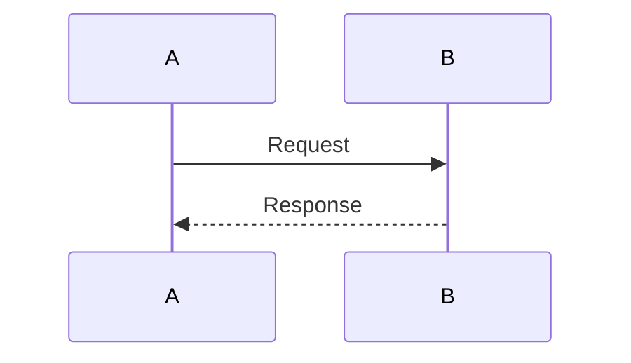

# RAGFlow - Tổng Quan Tài Liệu Phân Tích

Bộ tài liệu phân tích chi tiết code, thuật toán và logic của RAGFlow.

---

## 📚 Cấu Trúc Tài Liệu

### **01-API-LAYER/** - API Gateway & Request Handling
Phân tích chi tiết về HTTP request handling, routing, authentication và các API endpoints.

| File | Mô Tả |
|------|-------|
| `README.md` | Tổng quan API Layer |
| `document_app_analysis.md` | Phân tích document upload/management API |
| `conversation_app_analysis.md` | Phân tích chat/conversation API |
| `canvas_app_analysis.md` | Phân tích agent workflow API |
| `authentication_flow.md` | Chi tiết JWT/API token authentication |
| `request_lifecycle.md` | Lifecycle của một HTTP request |

### **02-SERVICE-LAYER/** - Business Logic Layer
Phân tích business logic, orchestration và service patterns.

| File | Mô Tả |
|------|-------|
| `README.md` | Tổng quan Service Layer |
| `dialog_service_analysis.md` | Chat/Dialog service với RAG integration |
| `document_service_analysis.md` | Document management service |
| `llm_service_analysis.md` | LLM abstraction layer |
| `task_service_analysis.md` | Background task management |
| `knowledgebase_service_analysis.md` | Knowledge base operations |

### **03-RAG-ENGINE/** - Retrieval-Augmented Generation
Phân tích các thuật toán RAG core: search, embedding, reranking.

| File | Mô Tả |
|------|-------|
| `README.md` | Tổng quan RAG Engine |
| `hybrid_search_algorithm.md` | Thuật toán hybrid search (Vector + BM25) |
| `embedding_generation.md` | Text embedding và vector generation |
| `rerank_algorithm.md` | Result reranking với cross-encoder |
| `chunking_strategies.md` | Document chunking strategies |
| `prompt_engineering.md` | Prompt construction và optimization |
| `query_processing.md` | Query analysis và keyword extraction |

### **04-AGENT-SYSTEM/** - Agentic Workflows
Phân tích agent/workflow execution engine và components.

| File | Mô Tả |
|------|-------|
| `README.md` | Tổng quan Agent System |
| `canvas_execution_engine.md` | Canvas DSL parsing và execution |
| `component_architecture.md` | Component-based architecture |
| `component_llm_analysis.md` | LLM Component chi tiết |
| `component_retrieval_analysis.md` | Retrieval Component |
| `component_categorize_analysis.md` | Categorize Component |
| `tool_integration_framework.md` | Tool registry và execution |
| `workflow_patterns.md` | ReAct, CoT, Self-Consistency patterns |

### **05-DOCUMENT-PROCESSING/** - Document Parsing Pipeline
Phân tích document processing, OCR và task execution.

| File | Mô Tả |
|------|-------|
| `README.md` | Tổng quan Document Processing |
| `task_executor_analysis.md` | Background task execution với Trio |
| `parser_algorithms.md` | Document parser strategies |
| `ocr_pipeline.md` | OCR workflow (PaddleOCR, Tesseract) |
| `pdf_parsing.md` | PDF text extraction và layout analysis |
| `audio_transcription.md` | Whisper-based audio processing |
| `chunking_implementation.md` | Chunking implementation details |

### **06-ALGORITHMS/** - Core Algorithms & Math
Phân tích các thuật toán phức tạp với công thức toán học.

| File | Mô Tả |
|------|-------|
| `vector_similarity.md` | Cosine similarity và distance metrics |
| `bm25_scoring.md` | BM25 full-text scoring algorithm |
| `hybrid_score_fusion.md` | Vector + BM25 score fusion |
| `semantic_chunking.md` | Semantic-aware chunking |
| `citation_parsing.md` | Citation extraction algorithms |
| `token_counting.md` | Token counting và truncation |
| `embedding_normalization.md` | Vector normalization techniques |

---

## 🎯 Mục Đích Tài Liệu

### **1. Hiểu Rõ Code Flow**
- Trace request từ đầu đến cuối
- Hiểu data flow giữa các layers
- Debugging hiệu quả

### **2. Hiểu Thuật Toán**
- Giải thích chi tiết các algorithms
- Công thức toán học
- Complexity analysis
- Trade-offs và optimizations

### **3. Phát Triển Tính Năng Mới**
- Hiểu architecture patterns
- Extend existing components
- Integrate new tools/models

### **4. Performance Optimization**
- Identify bottlenecks
- Optimization strategies
- Scalability considerations

---

## 📖 Cách Sử Dụng

### **Kịch Bản 1: Hiểu Document Upload Flow**

```
1. Đọc: 01-API-LAYER/document_app_analysis.md
   → Hiểu API endpoint và validation

2. Đọc: 02-SERVICE-LAYER/document_service_analysis.md
   → Hiểu business logic

3. Đọc: 05-DOCUMENT-PROCESSING/task_executor_analysis.md
   → Hiểu background processing

4. Đọc: 05-DOCUMENT-PROCESSING/parser_algorithms.md
   → Hiểu parsing strategies
```

### **Kịch Bản 2: Hiểu RAG Retrieval**

```
1. Đọc: 03-RAG-ENGINE/README.md
   → Tổng quan RAG pipeline

2. Đọc: 03-RAG-ENGINE/hybrid_search_algorithm.md
   → Hiểu hybrid search

3. Đọc: 06-ALGORITHMS/vector_similarity.md
   → Hiểu vector similarity math

4. Đọc: 06-ALGORITHMS/bm25_scoring.md
   → Hiểu BM25 algorithm

5. Đọc: 03-RAG-ENGINE/rerank_algorithm.md
   → Hiểu reranking
```

### **Kịch Bản 3: Phát Triển Agent Component Mới**

```
1. Đọc: 04-AGENT-SYSTEM/README.md
   → Tổng quan architecture

2. Đọc: 04-AGENT-SYSTEM/component_architecture.md
   → Hiểu component pattern

3. Đọc: 04-AGENT-SYSTEM/component_llm_analysis.md
   → Xem example implementation

4. Implement component mới theo pattern
```

---

## 🔍 Convention Trong Tài Liệu

### **Sequence Diagrams**
Sử dụng Mermaid syntax:


### **Công Thức Toán Học**
Sử dụng LaTeX syntax:
```
Score = α × VectorScore + (1 - α) × BM25Score
where α ∈ [0, 1]
```

### **Code Examples**
```python
# Clear, commented code examples
def example_function():
    """Docstring explaining purpose"""
    pass
```

### **Complexity Analysis**
```
Time Complexity: O(n log n)
Space Complexity: O(n)
```

---

## 📊 Thuật Toán Chính

### **1. Hybrid Search**
- **File:** `03-RAG-ENGINE/hybrid_search_algorithm.md`
- **Complexity:** O(n log k) where k = top_k
- **Key:** Vector search + BM25 fusion

### **2. BM25 Scoring**
- **File:** `06-ALGORITHMS/bm25_scoring.md`
- **Complexity:** O(n) per document
- **Key:** TF-IDF variant with document length normalization

### **3. Cosine Similarity**
- **File:** `06-ALGORITHMS/vector_similarity.md`
- **Complexity:** O(d) where d = embedding dimension
- **Key:** Dot product of normalized vectors

### **4. Semantic Chunking**
- **File:** `06-ALGORITHMS/semantic_chunking.md`
- **Complexity:** O(n²) for boundary detection
- **Key:** Semantic coherence scoring

### **5. Reranking**
- **File:** `03-RAG-ENGINE/rerank_algorithm.md`
- **Complexity:** O(k × m) where k = candidates, m = model inference
- **Key:** Cross-encoder scoring

---

## 🎨 Diagram Types

Các loại diagrams được sử dụng:

| Type | Purpose | Tool |
|------|---------|------|
| **Sequence Diagram** | Flow of operations | Mermaid |
| **Flowchart** | Logic flow | Mermaid |
| **Component Diagram** | Architecture | Mermaid |
| **State Machine** | State transitions | Mermaid |
| **Math Formulas** | Algorithms | LaTeX |

---

## 📈 Performance Metrics

Metrics được phân tích trong tài liệu:

| Metric | Typical Value | File |
|--------|--------------|------|
| **Vector Search Latency** | < 100ms | `03-RAG-ENGINE/hybrid_search_algorithm.md` |
| **BM25 Scoring** | < 50ms | `06-ALGORITHMS/bm25_scoring.md` |
| **Reranking** | 200-500ms | `03-RAG-ENGINE/rerank_algorithm.md` |
| **Document Parsing** | 5-30s | `05-DOCUMENT-PROCESSING/parser_algorithms.md` |
| **Embedding Generation** | 1-5s/batch | `03-RAG-ENGINE/embedding_generation.md` |
| **LLM Chat** | 2-10s | `02-SERVICE-LAYER/llm_service_analysis.md` |

---

## 🚀 Quick Start

### **Đọc Tài Liệu Từ Đâu?**

**Nếu bạn là:**

**👨‍💻 Backend Developer**
```
Start: 01-API-LAYER/README.md
→ 02-SERVICE-LAYER/README.md
→ 03-RAG-ENGINE/README.md
```

**🤖 AI/ML Engineer**
```
Start: 03-RAG-ENGINE/README.md
→ 06-ALGORITHMS/
→ 04-AGENT-SYSTEM/README.md
```

**📊 Data Scientist**
```
Start: 06-ALGORITHMS/
→ 03-RAG-ENGINE/hybrid_search_algorithm.md
→ 03-RAG-ENGINE/rerank_algorithm.md
```

**🎯 Product Manager**
```
Start: 00-OVERVIEW.md (this file)
→ 01-API-LAYER/README.md
→ 04-AGENT-SYSTEM/README.md
```

---

## 🔗 Liên Kết Nhanh

### **Top 10 Files Quan Trọng Nhất:**

1. **[Hybrid Search Algorithm](03-RAG-ENGINE/hybrid_search_algorithm.md)** - Core retrieval
2. **[Dialog Service Analysis](02-SERVICE-LAYER/dialog_service_analysis.md)** - Chat orchestration
3. **[Canvas Execution Engine](04-AGENT-SYSTEM/canvas_execution_engine.md)** - Workflow engine
4. **[Task Executor Analysis](05-DOCUMENT-PROCESSING/task_executor_analysis.md)** - Background processing
5. **[Vector Similarity](06-ALGORITHMS/vector_similarity.md)** - Similarity math
6. **[BM25 Scoring](06-ALGORITHMS/bm25_scoring.md)** - Full-text search
7. **[Document App Analysis](01-API-LAYER/document_app_analysis.md)** - Upload API
8. **[Conversation App Analysis](01-API-LAYER/conversation_app_analysis.md)** - Chat API
9. **[Component Architecture](04-AGENT-SYSTEM/component_architecture.md)** - Agent components
10. **[Prompt Engineering](03-RAG-ENGINE/prompt_engineering.md)** - Prompt construction

---

## 📝 Contribution Guidelines

Khi cập nhật tài liệu:

1. ✅ **Luôn có Sequence Diagram** cho flows
2. ✅ **Giải thích công thức** với LaTeX
3. ✅ **Code examples** với comments
4. ✅ **Complexity analysis** cho algorithms
5. ✅ **Performance metrics** nếu có
6. ✅ **Tradeoffs** và design decisions

---

## 📅 Last Updated

**Version:** 1.0
**Date:** 2025-11-23
**RAGFlow Version:** 0.9.0

---

## 🎯 Next Steps

Sau khi đọc overview này:

1. Chọn layer bạn quan tâm từ menu trên
2. Đọc README.md của layer đó
3. Đi sâu vào các file phân tích chi tiết
4. Trace code theo sequence diagrams
5. Hiểu algorithms với công thức

**Happy Learning! 🚀**
