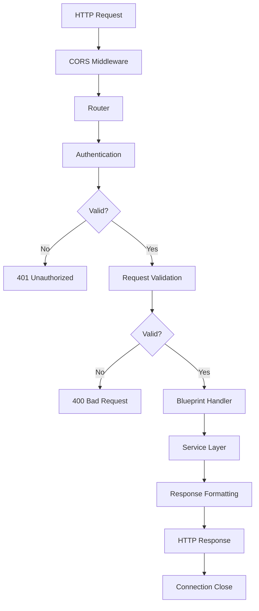
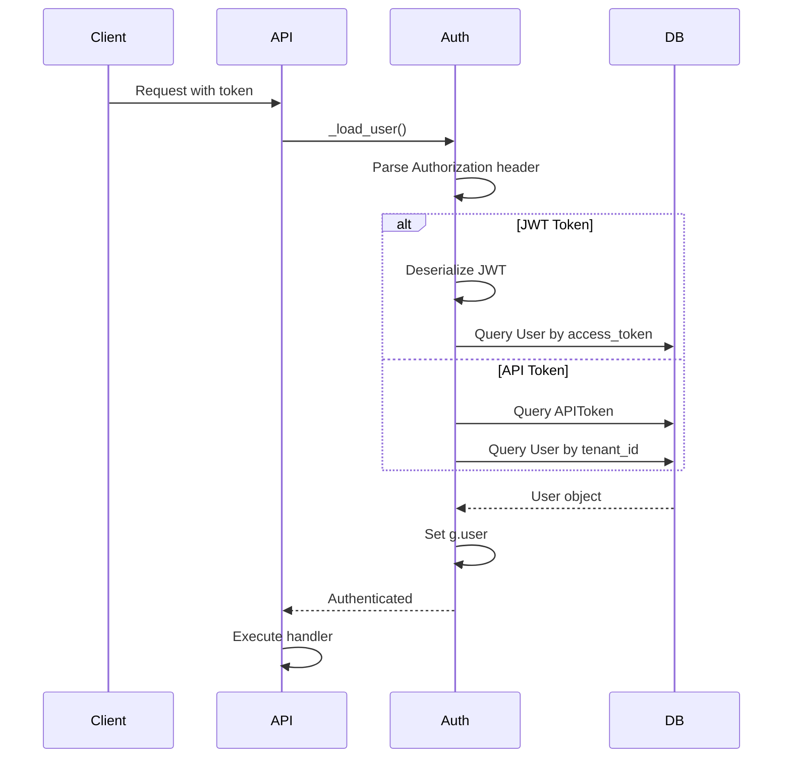

# API Layer - Tổng Quan

API Gateway Layer xử lý tất cả HTTP requests, routing, authentication và response formatting.

---

## 📁 Cấu Trúc Thư Mục

```
api/apps/
├── __init__.py              # Flask/Quart app initialization
├── document_app.py          # Document management endpoints
├── conversation_app.py      # Chat/conversation endpoints
├── dialog_app.py            # Dialog configuration endpoints
├── canvas_app.py            # Agent workflow endpoints
├── kb_app.py                # Knowledge base endpoints
├── file_app.py              # File management endpoints
├── user_app.py              # User management endpoints
├── llm_app.py               # LLM configuration endpoints
└── sdk/                     # SDK-specific endpoints
    ├── chat.py              # Chat SDK
    ├── agents.py            # Agent SDK
    ├── doc.py               # Document SDK
    └── dataset.py           # Dataset SDK
```

---

## 🎯 Chức Năng Chính

### **1. Request Routing**
- Auto-discovery của blueprints
- Dynamic URL registration
- API versioning

### **2. Authentication & Authorization**
- JWT token validation
- API token support
- Permission checking

### **3. Request Validation**
- Input validation với decorators
- Schema validation
- Error handling

### **4. Response Formatting**
- Consistent JSON response format
- Error responses
- SSE (Server-Sent Events) streaming

---

## 🔄 Request Lifecycle



---

## 📝 Tài Liệu Chi Tiết

| File | Mô Tả | Độ Phức Tạp |
|------|-------|-------------|
| `request_lifecycle.md` | Chi tiết lifecycle của HTTP request | ⭐⭐ |
| `authentication_flow.md` | JWT & API token authentication | ⭐⭐⭐ |
| `document_app_analysis.md` | Document upload/management API | ⭐⭐⭐⭐ |
| `conversation_app_analysis.md` | Chat/conversation API với SSE | ⭐⭐⭐⭐ |
| `canvas_app_analysis.md` | Agent workflow execution API | ⭐⭐⭐⭐⭐ |
| `validation_patterns.md` | Input validation strategies | ⭐⭐ |
| `error_handling.md` | Error handling patterns | ⭐⭐ |

---

## 🔐 Authentication

### **Supported Methods**

1. **JWT Token** - User sessions
   ```python
   Authorization: Bearer <jwt_token>
   ```

2. **API Token** - Service-to-service
   ```python
   Authorization: Bearer <api_token>
   ```

### **Authentication Flow**



---

## 📊 API Endpoints Tổng Quan

### **Document Management**
| Endpoint | Method | Purpose |
|----------|--------|---------|
| `/v1/document/upload` | POST | Upload documents |
| `/v1/document/list` | POST | List documents |
| `/v1/document/run` | POST | Trigger parsing |
| `/v1/document/rm` | POST | Delete documents |
| `/v1/document/rename` | POST | Rename document |

### **Conversation/Chat**
| Endpoint | Method | Purpose |
|----------|--------|---------|
| `/v1/conversation/set` | POST | Create/update conversation |
| `/v1/conversation/completion` | POST | Chat with streaming |
| `/v1/conversation/get` | GET | Get conversation history |
| `/v1/conversation/rm` | POST | Delete conversation |

### **Agent/Workflow**
| Endpoint | Method | Purpose |
|----------|--------|---------|
| `/v1/canvas/set` | POST | Save canvas/workflow |
| `/v1/canvas/get` | GET | Get canvas definition |
| `/v1/canvas/completion` | POST | Execute workflow |
| `/v1/canvas/templates` | GET | Get templates |

### **Knowledge Base**
| Endpoint | Method | Purpose |
|----------|--------|---------|
| `/v1/kb/create` | POST | Create KB |
| `/v1/kb/update` | POST | Update KB config |
| `/v1/kb/list` | GET | List KBs |
| `/v1/kb/rm` | POST | Delete KB |

---

## 🛠️ Common Patterns

### **1. Decorator Pattern**

```python
@manager.route("/endpoint", methods=["POST"])
@login_required
@validate_request("param1", "param2")
async def handler():
    req = await request.json
    # Handle request
    return get_json_result(data=result)
```

### **2. Response Format**

```python
# Success
{
    "code": 0,
    "message": "",
    "data": {...}
}

# Error
{
    "code": 500,
    "message": "Error message",
    "data": None
}
```

### **3. SSE Streaming**

```python
def stream():
    for chunk in generator():
        yield f"data: {json.dumps(chunk)}\n\n"
    yield f"data: {json.dumps({'done': True})}\n\n"

resp = Response(stream(), mimetype="text/event-stream")
resp.headers.add_header("Cache-Control", "no-cache")
return resp
```

---

## 🔧 Technology Stack

| Component | Technology | Version |
|-----------|------------|---------|
| **Web Framework** | Quart | 0.19.x |
| **WSGI Utilities** | Werkzeug | 3.0.x |
| **API Docs** | Flasgger | Latest |
| **CORS** | quart-cors | Latest |
| **Serialization** | itsdangerous | Latest |
| **Session** | Flask-Session | Latest |

---

## 📈 Performance

### **Typical Latencies**

| Operation | Latency | Notes |
|-----------|---------|-------|
| **Authentication** | < 10ms | JWT decode + DB query |
| **Request Validation** | < 5ms | Schema validation |
| **Simple GET** | 10-50ms | No heavy processing |
| **Document Upload** | 100-500ms | Depends on file size |
| **Chat Streaming** | 2-10s | LLM generation time |
| **Workflow Execution** | 5-60s | Depends on complexity |

### **Optimization Strategies**

1. **Connection Pooling** - Reuse DB connections
2. **Async I/O** - Non-blocking operations
3. **Response Caching** - Redis cache for static data
4. **Lazy Loading** - Load user only when needed
5. **Streaming** - SSE for long-running operations

---

## 🐛 Debugging Tips

### **1. Enable Debug Logging**

```python
import logging
logging.getLogger('quart.serving').setLevel(logging.DEBUG)
```

### **2. Trace Request**

```python
@app.before_request
async def log_request():
    logging.debug(f"Request: {request.method} {request.path}")
    logging.debug(f"Headers: {request.headers}")
    logging.debug(f"Body: {await request.json}")
```

### **3. Check Authentication**

```python
@app.before_request
async def check_auth():
    if current_user:
        logging.info(f"User: {current_user.email}")
    else:
        logging.warning("No user authenticated")
```

---

## 📚 Đọc Tiếp

**Recommended Reading Order:**

1. `request_lifecycle.md` - Hiểu flow cơ bản
2. `authentication_flow.md` - Hiểu auth mechanism
3. `document_app_analysis.md` - Endpoint phức tạp nhất
4. `conversation_app_analysis.md` - SSE streaming
5. `canvas_app_analysis.md` - Agent execution

---

**Last Updated:** 2025-11-23
