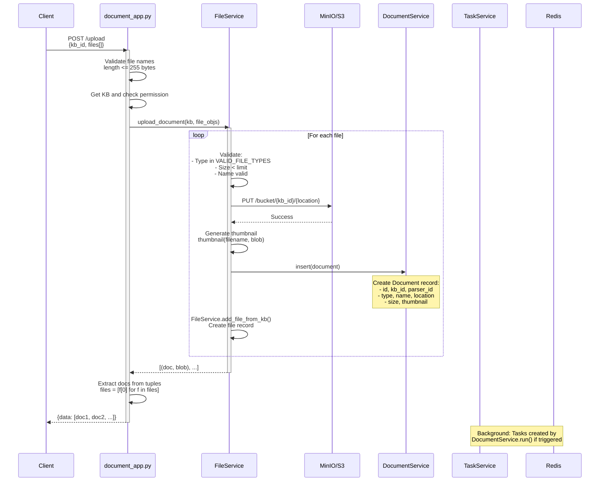
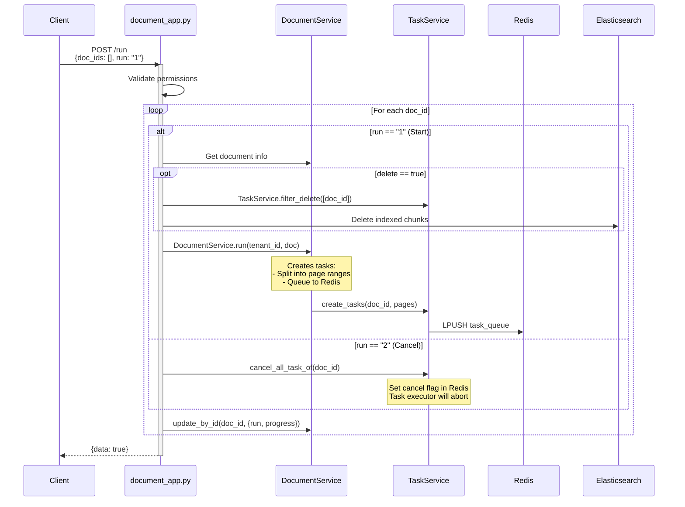
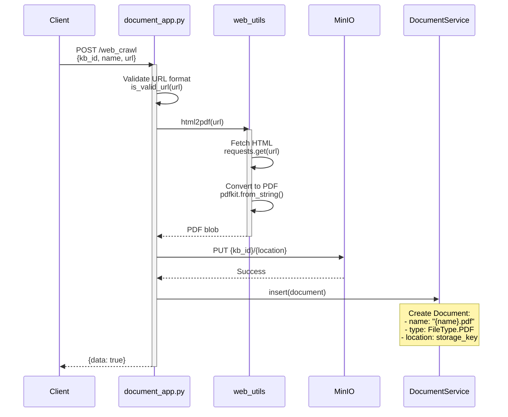

# Document App - Phân Tích Chi Tiết

Phân tích module `api/apps/document_app.py` - Document upload và management API.

**File:** `api/apps/document_app.py`
**Lines:** 708
**Complexity:** ⭐⭐⭐⭐

---

## 📋 Mục Lục

1. [Tổng Quan](#tổng-quan)
2. [Upload Flow](#upload-flow)
3. [Document Run/Parse Flow](#document-runparse-flow)
4. [Web Crawl Flow](#web-crawl-flow)
5. [Algorithms](#algorithms)
6. [Performance Analysis](#performance-analysis)

---

## Tổng Quan

### **Chức Năng Chính**

| Endpoint | Method | Purpose | Complexity |
|----------|--------|---------|------------|
| `/upload` | POST | Upload documents | ⭐⭐⭐⭐ |
| `/web_crawl` | POST | Crawl and parse web page | ⭐⭐⭐ |
| `/list` | POST | List documents with filters | ⭐⭐ |
| `/run` | POST | Trigger document parsing | ⭐⭐⭐⭐ |
| `/rm` | POST | Delete documents | ⭐⭐ |
| `/rename` | POST | Rename document | ⭐⭐ |
| `/change_parser` | POST | Change parser type | ⭐⭐⭐ |
| `/get/<doc_id>` | GET | Download document | ⭐ |

### **Dependencies**

```python
from api.db.services.document_service import DocumentService
from api.db.services.file_service import FileService
from api.db.services.knowledgebase_service import KnowledgebaseService
from api.db.services.task_service import TaskService
from common import settings  # Storage backend
```

---

## Upload Flow

### **Sequence Diagram**



### **Code Analysis**

```python
@manager.route("/upload", methods=["POST"])
@login_required
@validate_request("kb_id")
async def upload():
    form = await request.form
    kb_id = form.get("kb_id")

    # Get files from multipart form
    files = await request.files
    file_objs = files.getlist("file")

    # Validation
    for file_obj in file_objs:
        if file_obj.filename == "":
            return get_json_result(
                data=False,
                message="No file selected!",
                code=RetCode.ARGUMENT_ERROR
            )
        if len(file_obj.filename.encode("utf-8")) > FILE_NAME_LEN_LIMIT:
            return get_json_result(
                data=False,
                message=f"File name must be {FILE_NAME_LEN_LIMIT} bytes or less.",
                code=RetCode.ARGUMENT_ERROR
            )

    # Check KB permission
    e, kb = KnowledgebaseService.get_by_id(kb_id)
    if not check_kb_team_permission(kb, current_user.id):
        return get_json_result(
            data=False,
            message="No authorization.",
            code=RetCode.AUTHENTICATION_ERROR
        )

    # Upload files
    err, files = FileService.upload_document(kb, file_objs, current_user.id)

    # Return doc objects (without blob)
    files = [f[0] for f in files]
    return get_json_result(data=files)
```

### **Validation Logic**

**1. File Name Validation**

```python
FILE_NAME_LEN_LIMIT = 255  # bytes

# Check UTF-8 encoded length
if len(filename.encode("utf-8")) > FILE_NAME_LEN_LIMIT:
    raise ValidationError()
```

**Rationale:**
- File systems have 255-byte limit for filenames
- UTF-8 encoding: 1 char can be 1-4 bytes
- Example: "你好.pdf" = 9 bytes (6 for chars + 3 for extension)

**2. File Type Validation**

```python
VALID_FILE_TYPES = {
    "pdf", "docx", "doc", "txt", "md", "json",
    "ppt", "pptx", "pages",
    "xls", "xlsx", "csv",
    "jpg", "jpeg", "png", "gif", "bmp", "tiff",
    "mp3", "wav", "m4a",
    "eml", "msg"
}

def filename_type(filename):
    """Determine file type from extension"""
    ext = Path(filename).suffix.lstrip(".").lower()

    if ext in ["pdf", "docx", "doc", "txt", "md", ...]:
        return FileType.DOCUMENT
    elif ext in ["jpg", "jpeg", "png", ...]:
        return FileType.VISUAL
    elif ext in ["mp3", "wav", ...]:
        return FileType.AURAL
    else:
        return FileType.OTHER
```

**3. Permission Check**

```python
def check_kb_team_permission(kb, user_id):
    """Check if user can access KB"""
    # Get user's tenants
    tenants = UserTenantService.query(user_id=user_id)

    # Check if KB belongs to any of user's tenants
    for tenant in tenants:
        if kb.tenant_id == tenant.tenant_id:
            return True

    return False
```

---

## Document Run/Parse Flow

### **Trigger Parsing**



### **Algorithm: Task Splitting**

**Problem:** Large documents need to be split into smaller tasks for parallel processing.

**Strategy:** Page-based splitting

```python
def create_tasks(doc_id, total_pages, batch_size=10):
    """
    Split document into page-range tasks

    Args:
        doc_id: Document ID
        total_pages: Total number of pages
        batch_size: Pages per task (default: 10)

    Returns:
        List of task objects
    """
    tasks = []

    for from_page in range(0, total_pages, batch_size):
        to_page = min(from_page + batch_size, total_pages)

        task = {
            "id": get_uuid(),
            "doc_id": doc_id,
            "from_page": from_page,
            "to_page": to_page,
            "progress": 0.0,
            "retry_count": 0,
            "create_time": current_timestamp()
        }
        tasks.append(task)

    return tasks
```

**Complexity:**
- **Time:** O(n / batch_size) = O(n)
- **Space:** O(n / batch_size) = O(n)

**Example:**
```
Document: 237 pages, batch_size=10

Tasks created:
- Task 1: pages 0-9
- Task 2: pages 10-19
- ...
- Task 24: pages 230-237

Total tasks: 24
```

**Trade-offs:**
- **Larger batch_size:**
  - ✅ Fewer tasks, less overhead
  - ❌ Longer per-task execution, less parallelism
- **Smaller batch_size:**
  - ✅ More parallelism, finer progress tracking
  - ❌ More overhead, more Redis operations

---

## Web Crawl Flow

### **Sequence Diagram**



### **URL Validation**

```python
def is_valid_url(url):
    """
    Validate URL format

    Checks:
    1. Starts with http:// or https://
    2. Has valid domain
    3. No dangerous characters
    """
    import re

    # Pattern: http(s)://domain.tld/path
    pattern = re.compile(
        r'^https?://'  # http:// or https://
        r'(?:(?:[A-Z0-9](?:[A-Z0-9-]{0,61}[A-Z0-9])?\.)+[A-Z]{2,6}\.?|'  # domain
        r'localhost|'  # localhost
        r'\d{1,3}\.\d{1,3}\.\d{1,3}\.\d{1,3})'  # IP
        r'(?::\d+)?'  # optional port
        r'(?:/?|[/?]\S+)$', re.IGNORECASE)

    return bool(pattern.match(url))
```

**Test Cases:**
```python
assert is_valid_url("https://example.com") == True
assert is_valid_url("http://localhost:8080/path") == True
assert is_valid_url("https://192.168.1.1") == True
assert is_valid_url("ftp://example.com") == False
assert is_valid_url("javascript:alert(1)") == False
```

---

## Algorithms

### **Algorithm 1: Duplicate Name Handling**

**Problem:** Prevent name collisions when uploading documents.

```python
def duplicate_name(query_func, name, kb_id):
    """
    Generate unique name if duplicate exists

    Strategy: Append counter (name_1, name_2, ...)

    Args:
        query_func: Function to query existing docs
        name: Original filename
        kb_id: Knowledge base ID

    Returns:
        Unique filename

    Complexity: O(n) where n = number of duplicates
    """
    original_name = name
    counter = 1

    while query_func(name=name, kb_id=kb_id):
        # Split name and extension
        stem = Path(original_name).stem
        ext = Path(original_name).suffix

        # Generate new name
        name = f"{stem}_{counter}{ext}"
        counter += 1

    return name
```

**Example:**
```
Input: "report.pdf" (already exists)

Iteration 1: Check "report.pdf" → exists
           Try "report_1.pdf"

Iteration 2: Check "report_1.pdf" → exists
           Try "report_2.pdf"

Iteration 3: Check "report_2.pdf" → not exists
           Return "report_2.pdf"
```

**Worst Case:** O(n) queries if there are n duplicates

---

### **Algorithm 2: Thumbnail Generation**

```python
def thumbnail(filename, blob):
    """
    Generate thumbnail for document

    Strategy:
    - PDF: Extract first page
    - Image: Resize to 200x200
    - Others: Use default icon

    Returns:
        Base64 encoded thumbnail or None
    """
    import io
    from PIL import Image
    import fitz  # PyMuPDF

    ext = Path(filename).suffix.lstrip(".").lower()

    if ext in ["jpg", "jpeg", "png", "gif", "bmp"]:
        # Resize image
        img = Image.open(io.BytesIO(blob))
        img.thumbnail((200, 200))

        # Convert to base64
        buffer = io.BytesIO()
        img.save(buffer, format="PNG")
        return base64.b64encode(buffer.getvalue()).decode()

    elif ext == "pdf":
        # Extract first page
        doc = fitz.open(stream=blob, filetype="pdf")
        page = doc.load_page(0)

        # Render at 72 DPI
        pix = page.get_pixmap(dpi=72)
        img_data = pix.tobytes("png")

        return base64.b64encode(img_data).decode()

    else:
        return None  # Use default icon
```

**Complexity:**
- **Image resize:** O(w × h) where w, h = dimensions
- **PDF render:** O(page_complexity)

---

### **Algorithm 3: Rename with Index Update**

**Problem:** When renaming a document, also update Elasticsearch index.

```python
@manager.route("/rename", methods=["POST"])
@validate_request("doc_id", "name")
async def rename():
    req = await request_json()

    # 1. Validate new name
    e, doc = DocumentService.get_by_id(req["doc_id"])

    # Check extension not changed
    if pathlib.Path(req["name"].lower()).suffix != \
       pathlib.Path(doc.name.lower()).suffix:
        return error("Extension cannot be changed")

    # Check no duplicate
    for d in DocumentService.query(name=req["name"], kb_id=doc.kb_id):
        if d.name == req["name"]:
            return error("Duplicate name")

    # 2. Update database
    DocumentService.update_by_id(req["doc_id"], {"name": req["name"]})

    # 3. Update file record
    informs = File2DocumentService.get_by_document_id(req["doc_id"])
    if informs:
        e, file = FileService.get_by_id(informs[0].file_id)
        FileService.update_by_id(file.id, {"name": req["name"]})

    # 4. Update Elasticsearch index
    tenant_id = DocumentService.get_tenant_id(req["doc_id"])

    # Tokenize new name
    title_tks = rag_tokenizer.tokenize(req["name"])

    es_body = {
        "docnm_kwd": req["name"],
        "title_tks": title_tks,
        "title_sm_tks": rag_tokenizer.fine_grained_tokenize(title_tks)
    }

    # Update all chunks of this document
    if settings.docStoreConn.indexExist(search.index_name(tenant_id), doc.kb_id):
        settings.docStoreConn.update(
            {"doc_id": req["doc_id"]},  # Filter
            es_body,                     # Update
            search.index_name(tenant_id),
            doc.kb_id
        )

    return get_json_result(data=True)
```

**Steps:**
1. Validate extension unchanged
2. Check no duplicate names
3. Update Document table
4. Update File table
5. Tokenize new name
6. Update all chunks in Elasticsearch

**Complexity:**
- **Database updates:** O(1) for each table
- **ES update:** O(k) where k = number of chunks

**Why update ES?**
- Title is searchable field
- Need fresh tokens for BM25 scoring
- Maintain consistency between DB and index

---

## Performance Analysis

### **Bottlenecks**

| Operation | Latency | Bottleneck | Optimization |
|-----------|---------|------------|--------------|
| **File Upload** | 100-500ms | Network I/O, Storage write | Use async I/O, compress before upload |
| **Validation** | 5-10ms | Multiple checks | Batch validations |
| **Thumbnail Gen** | 50-200ms | Image processing | Generate async, cache |
| **DB Insert** | 10-20ms | Transaction overhead | Batch inserts |
| **ES Update** | 50-100ms | Network + indexing | Bulk updates |

### **Optimization Strategies**

**1. Batch Processing**

```python
# Bad: Loop inserts
for doc in docs:
    DocumentService.insert(doc)  # N queries

# Good: Batch insert
DocumentService.bulk_insert(docs)  # 1 query
```

**2. Async I/O**

```python
# Upload to storage asynchronously
await asyncio.gather(
    storage.put(kb_id, loc1, blob1),
    storage.put(kb_id, loc2, blob2),
    storage.put(kb_id, loc3, blob3)
)
```

**3. Lazy Thumbnail**

```python
# Generate thumbnail in background
# Return immediately with placeholder
def upload_document(...):
    # ... save document ...

    # Schedule thumbnail generation
    asyncio.create_task(generate_thumbnail(doc_id))

    return doc  # Return immediately
```

### **Scalability**

**Current Limits:**
- **File size:** 1GB (configurable via MAX_CONTENT_LENGTH)
- **Concurrent uploads:** Limited by Quart workers
- **Storage:** Limited by MinIO/S3 capacity

**Scale to 10x:**
1. Add load balancer
2. Increase Quart workers
3. Use distributed storage (S3)
4. Add Redis caching for file metadata
5. Background thumbnail generation

---

## Error Handling

### **Common Errors**

```python
# 1. File too large
if file_size > MAX_FILE_SIZE:
    return get_json_result(
        data=False,
        message="File too large",
        code=RetCode.DATA_ERROR
    )

# 2. Invalid file type
if filetype == FileType.OTHER:
    return get_json_result(
        data=False,
        message="File type not supported",
        code=RetCode.DATA_ERROR
    )

# 3. Storage failure
try:
    storage.put(bucket, key, data)
except Exception as e:
    logging.exception("Storage error")
    return get_json_result(
        data=False,
        message="Upload failed",
        code=RetCode.SERVER_ERROR
    )

# 4. KB not found
e, kb = KnowledgebaseService.get_by_id(kb_id)
if not e:
    return get_json_result(
        data=False,
        message="Knowledge base not found",
        code=RetCode.DATA_ERROR
    )
```

---

## Testing

### **Unit Tests**

```python
import pytest
from api.apps.document_app import duplicate_name

def test_duplicate_name():
    # Mock query function
    existing = {"report.pdf", "report_1.pdf"}

    def query_func(name, kb_id):
        return name in existing

    # Test
    result = duplicate_name(query_func, "report.pdf", "kb_123")
    assert result == "report_2.pdf"

def test_unique_name():
    def query_func(name, kb_id):
        return False  # No duplicates

    result = duplicate_name(query_func, "unique.pdf", "kb_123")
    assert result == "unique.pdf"  # Unchanged
```

### **Integration Tests**

```python
@pytest.mark.asyncio
async def test_upload_document(client, test_kb):
    # Prepare file
    file_data = b"Test content"
    files = {
        "file": (io.BytesIO(file_data), "test.txt")
    }

    # Upload
    response = await client.post(
        "/v1/document/upload",
        data={"kb_id": test_kb["id"]},
        files=files
    )

    # Assert
    assert response.status_code == 200
    data = await response.get_json()
    assert len(data["data"]) == 1
    assert data["data"][0]["name"] == "test.txt"
```

---

## Summary

### **Key Takeaways**

1. **Multi-step validation** prevents invalid uploads
2. **Async I/O** improves throughput
3. **Duplicate handling** ensures unique names
4. **ES sync** maintains search consistency
5. **Error handling** provides clear feedback

### **Design Patterns Used**

- **Service Layer Pattern** - Business logic in services
- **Repository Pattern** - Data access abstraction
- **Decorator Pattern** - `@login_required`, `@validate_request`
- **Strategy Pattern** - Different parsers for file types

### **Files Referenced**

- `api/apps/document_app.py` - Main file
- `api/db/services/document_service.py` - Business logic
- `api/db/services/file_service.py` - File operations
- `api/db/services/task_service.py` - Task management
- `rag/utils/storage_factory.py` - Storage abstraction

---

**Next:** [conversation_app_analysis.md](conversation_app_analysis.md) - Chat API with SSE streaming

**Last Updated:** 2025-11-23
