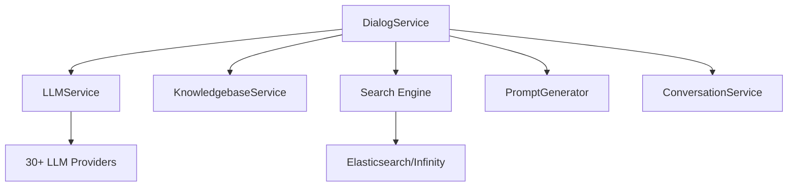
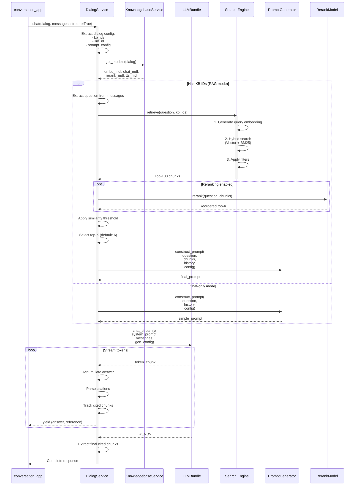
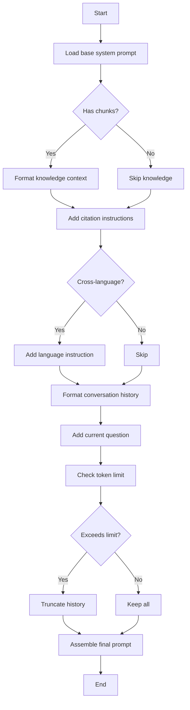

# Dialog Service - Phân Tích Chi Tiết

Phân tích `DialogService` - Service orchestrator chính cho RAG và Chat.

**File:** `api/db/services/dialog_service.py`
**Lines:** 1000+
**Complexity:** ⭐⭐⭐⭐⭐

---

## 📋 Mục Lục

1. [Tổng Quan](#tổng-quan)
2. [Chat Flow](#chat-flow)
3. [RAG Retrieval Flow](#rag-retrieval-flow)
4. [Prompt Construction](#prompt-construction)
5. [Citation Parsing](#citation-parsing)
6. [Algorithms](#algorithms)

---

## Tổng Quan

### **Chức Năng Chính**

DialogService là orchestrator trung tâm, kết nối:



### **Key Methods**

| Method | Purpose | Complexity |
|--------|---------|------------|
| `chat()` | Main chat orchestrator | ⭐⭐⭐⭐⭐ |
| `ask()` | Simple Q&A | ⭐⭐⭐ |
| `gen_mindmap()` | Knowledge graph generation | ⭐⭐⭐⭐ |
| `chat_solo()` | Chat without RAG | ⭐⭐ |
| `get_models()` | Load required models | ⭐⭐ |

---

## Chat Flow

### **Complete Sequence**



### **Code Analysis**

```python
def chat(dialog, messages, stream=True, **kwargs):
    """
    Main chat orchestrator

    Args:
        dialog: Dialog configuration object
        messages: List of message dicts
        stream: Whether to stream response
        **kwargs: Additional parameters

    Yields:
        dict: {answer, reference, audio_binary, prompt}
    """
    # 1. Get models
    kbs, embd_mdl, rerank_mdl, chat_mdl, tts_mdl = get_models(dialog)

    # 2. Check if RAG or chat-only
    if dialog.kb_ids:
        # RAG mode
        question = messages[-1]["content"]

        # 3. Retrieve chunks
        chunks = []
        for ans in ask(question, dialog.kb_ids, dialog.tenant_id):
            chunks = ans.get("chunks", [])

        # 4. Build prompt with knowledge
        prompt = construct_prompt(
            question=question,
            chunks=chunks,
            dialog=dialog,
            messages=messages[:-1]  # History
        )
    else:
        # Chat-only mode
        prompt = dialog.prompt_config.get("system", "")

    # 5. Generate response
    if stream:
        answer = ""
        cited_indices = set()

        for token in chat_mdl.chat_streamly(prompt, messages, dialog.llm_setting):
            answer += token

            # Parse citations incrementally
            cited = parse_citations(answer, chunks)
            cited_indices.update(cited)

            # Format response
            reference = {
                "chunks": [chunks[i] for i in sorted(cited_indices)],
                "doc_aggs": aggregate_docs(chunks, cited_indices)
            }

            yield {
                "answer": answer,
                "reference": reference,
                "audio_binary": tts(tts_mdl, token) if tts_mdl else None,
                "prompt": prompt,
                "created_at": time.time()
            }
    else:
        # Non-streaming
        answer = chat_mdl.chat(prompt, messages, dialog.llm_setting)
        # ... format and return
```

---

## RAG Retrieval Flow

### **ask() Method**

```python
def ask(question, kb_ids, tenant_id, search_config=None):
    """
    Retrieve relevant chunks for question

    Args:
        question: User question
        kb_ids: List of KB IDs to search
        tenant_id: Tenant ID
        search_config: Optional search configuration

    Yields:
        dict: {answer, chunks, doc_aggs}
    """
    # 1. Get embeddings
    kbs = KnowledgebaseService.get_by_ids(kb_ids)
    embd_mdl = get_embedding_model(kbs)

    # 2. Generate query vector
    query_vec = embd_mdl.encode([question])[0]

    # 3. Hybrid search
    dealer = Dealer(tenant_id, search_config)
    hits = dealer.search(
        query=question,
        embd_mdl=embd_mdl,
        kb_ids=kb_ids,
        top_k=search_config.get("top_k", 1024)
    )

    # 4. Metadata filtering
    if search_config.get("metadata_filters"):
        hits = meta_filter(
            hits,
            search_config["metadata_filters"],
            search_config.get("filter_logic", "and")
        )

    # 5. Similarity threshold
    similarity_threshold = search_config.get("similarity_threshold", 0.2)
    hits = [h for h in hits if h.get("similarity", 0) >= similarity_threshold]

    # 6. Reranking
    if search_config.get("rerank_id"):
        rerank_mdl = LLMBundle(tenant_id, LLMType.RERANK, search_config["rerank_id"])
        hits = rerank(question, hits, rerank_mdl, top_k=search_config.get("top_n", 6))

    # 7. Format chunks
    chunks = chunks_format(hits)

    # 8. Aggregate by document
    doc_aggs = aggregate_by_document(hits)

    yield {
        "answer": "",  # No answer yet
        "chunks": chunks,
        "doc_aggs": doc_aggs
    }
```

---

## Prompt Construction

### **Algorithm**



### **Implementation**

```python
def construct_prompt(question, chunks, dialog, messages):
    """
    Build final prompt with all components

    Args:
        question: Current question
        chunks: Retrieved chunks (if any)
        dialog: Dialog configuration
        messages: Conversation history

    Returns:
        str: Complete prompt
    """
    prompt_config = dialog.prompt_config
    components = []

    # 1. System prompt
    system = prompt_config.get("system", DEFAULT_SYSTEM_PROMPT)
    components.append(system)

    # 2. Knowledge context
    if chunks:
        knowledge = kb_prompt(chunks)
        # Format: "[ID:0] chunk1\n[ID:1] chunk2\n..."
        components.append(knowledge)

        # Citation instructions
        citation = citation_prompt()
        components.append(citation)

    # 3. Cross-language support
    if dialog.language != "English":
        lang_instruction = cross_languages(dialog.language)
        components.append(lang_instruction)

    # 4. Conversation history
    if messages:
        history = format_history(messages)
        components.append(history)

    # 5. Current question
    question_formatted = full_question(question, messages)
    components.append(f"User: {question_formatted}")

    # 6. Combine
    full_prompt = "\n\n".join(components)

    # 7. Check token limit
    max_tokens = dialog.llm_setting.get("max_tokens", 8000)
    prompt_tokens = num_tokens_from_string(full_prompt)

    if prompt_tokens > max_tokens * 0.7:  # Leave 30% for response
        # Truncate history
        full_prompt = truncate_prompt(full_prompt, max_tokens * 0.7)

    return full_prompt
```

### **kb_prompt() - Knowledge Formatting**

```python
def kb_prompt(chunks):
    """
    Format chunks with IDs for citation

    Args:
        chunks: List of chunk dicts

    Returns:
        str: Formatted knowledge context
    """
    lines = ["Here is the knowledge base:"]

    for i, chunk in enumerate(chunks):
        # Format: [ID:0] content
        content = chunk.get("content_with_weight", "")
        lines.append(f"[ID:{i}] {content}")

    return "\n".join(lines)
```

**Example Output:**
```
Here is the knowledge base:
[ID:0] RAG stands for Retrieval-Augmented Generation. It combines...
[ID:1] The RAG pipeline consists of three main steps: retrieval...
[ID:2] Vector embeddings are numerical representations of text...
```

---

## Citation Parsing

### **Supported Formats**

RAGFlow supports multiple citation formats:

```python
CITATION_PATTERNS = [
    r"\[ID: ?(\d+)\]",      # [ID:0], [ID: 1]
    r"【ID: ?(\d+)】",       # 【ID:0】 (Chinese brackets)
    r"\(ID: ?(\d+)\)",      # (ID:0)
    r"ref ?(\d+)",          # ref0, REF 1
]
```

### **Bad Citation Repair**

LLMs sometimes generate malformed citations:

```python
BAD_CITATION_PATTERNS = [
    re.compile(r"\(\s*ID\s*[: ]*\s*(\d+)\s*\)"),  # (ID: 12)
    re.compile(r"\[\s*ID\s*[: ]*\s*(\d+)\s*\]"),  # [ID: 12]
    re.compile(r"【\s*ID\s*[: ]*\s*(\d+)\s*】"),  # 【ID: 12】
    re.compile(r"ref\s*(\d+)", flags=re.IGNORECASE),  # ref12
]

def repair_bad_citation_formats(answer, kbinfos, idx):
    """
    Find and repair malformed citations

    Args:
        answer: LLM response text
        kbinfos: Knowledge context with chunks
        idx: Set of cited indices (mutated)

    Returns:
        Repaired answer, updated idx set
    """
    max_index = len(kbinfos["chunks"])

    def safe_add(i):
        if 0 <= i < max_index:
            idx.add(i)
            return True
        return False

    for pattern in BAD_CITATION_PATTERNS:
        def replacement(match):
            try:
                i = int(match.group(1))
                if safe_add(i):
                    return f"[ID:{i}]"  # Standardize format
            except Exception:
                pass
            return match.group(0)  # Keep original if invalid

        answer = re.sub(pattern, replacement, answer)

    return answer, idx
```

**Example:**
```
Input:  "According to (ID: 0), RAG is..."
Output: "According to [ID:0], RAG is..."

Input:  "ref 2 explains that..."
Output: "[ID:2] explains that..."
```

---

## Algorithms

### **Algorithm 1: Metadata Filtering**

```python
def meta_filter(chunks, filters, logic="and"):
    """
    Filter chunks by metadata conditions

    Args:
        chunks: List of chunk dicts
        filters: List of {op, key, value} conditions
        logic: "and" or "or"

    Returns:
        Filtered chunks

    Complexity: O(n × m)
        where n = number of chunks
              m = number of filters
    """
    filtered = []

    for chunk in chunks:
        meta = chunk.get("meta", {})

        # Check each filter
        results = []
        for f in filters:
            value = meta.get(f["key"])

            if f["op"] == "=":
                results.append(value == f["value"])
            elif f["op"] == "≠":
                results.append(value != f["value"])
            elif f["op"] == ">":
                try:
                    results.append(float(value) > float(f["value"]))
                except:
                    results.append(False)
            elif f["op"] == "<":
                try:
                    results.append(float(value) < float(f["value"]))
                except:
                    results.append(False)
            elif f["op"] == "contains":
                results.append(f["value"] in str(value))

        # Combine results
        if logic == "and":
            match = all(results)
        else:  # "or"
            match = any(results)

        if match:
            filtered.append(chunk)

    return filtered
```

**Example:**
```python
filters = [
    {"op": "=", "key": "department", "value": "engineering"},
    {"op": ">", "key": "year", "value": 2020}
]

# Filters chunks where:
# department == "engineering" AND year > 2020
```

---

### **Algorithm 2: Document Aggregation**

```python
def aggregate_by_document(chunks):
    """
    Group chunks by document and count

    Args:
        chunks: List of chunk dicts

    Returns:
        List of {doc_id, doc_name, count} dicts

    Complexity: O(n)
    """
    doc_map = {}

    for chunk in chunks:
        doc_id = chunk.get("doc_id")
        if not doc_id:
            continue

        if doc_id not in doc_map:
            doc_map[doc_id] = {
                "doc_id": doc_id,
                "doc_name": chunk.get("docnm_kwd", "Unknown"),
                "count": 0
            }

        doc_map[doc_id]["count"] += 1

    # Sort by count descending
    result = sorted(
        doc_map.values(),
        key=lambda x: x["count"],
        reverse=True
    )

    return result
```

**Example Output:**
```python
[
    {"doc_id": "doc_123", "doc_name": "RAG_paper.pdf", "count": 4},
    {"doc_id": "doc_456", "doc_name": "Tutorial.pdf", "count": 2},
    {"doc_id": "doc_789", "doc_name": "FAQ.pdf", "count": 1}
]
```

---

### **Algorithm 3: Token Counting & Truncation**

```python
def num_tokens_from_string(text, encoding_name="cl100k_base"):
    """
    Count tokens in text

    Uses tiktoken library (OpenAI's tokenizer)

    Args:
        text: Input text
        encoding_name: Tokenizer to use

    Returns:
        int: Number of tokens
    """
    import tiktoken

    encoding = tiktoken.get_encoding(encoding_name)
    tokens = encoding.encode(text)
    return len(tokens)
```

**Truncation Strategy:**

```python
def message_fit_in(messages, max_tokens=8000):
    """
    Truncate message history to fit token limit

    Strategy:
    1. Always keep system prompt
    2. Always keep last user message
    3. Truncate middle history if needed

    Args:
        messages: List of message dicts
        max_tokens: Token budget

    Returns:
        Truncated messages
    """
    if not messages:
        return []

    # Count tokens
    total_tokens = sum(
        num_tokens_from_string(m.get("content", ""))
        for m in messages
    )

    if total_tokens <= max_tokens:
        return messages  # Fits already

    # Keep system and last message
    result = []

    if messages[0]["role"] == "system":
        result.append(messages[0])
        remaining = messages[1:]
    else:
        remaining = messages

    # Always keep last message
    result.append(remaining[-1])

    # Fill middle from recent history
    budget = max_tokens - sum(
        num_tokens_from_string(m.get("content", ""))
        for m in result
    )

    for msg in reversed(remaining[:-1]):
        msg_tokens = num_tokens_from_string(msg.get("content", ""))
        if msg_tokens > budget:
            break
        result.insert(-1, msg)  # Insert before last
        budget -= msg_tokens

    return result
```

**Example:**
```python
Input messages (15K tokens):
  [System (100), User1 (200), Asst1 (300), ..., User10 (200)]

max_tokens = 8000

Output:
  [System (100), User7 (200), Asst7 (300), ..., User10 (200)]
  Total: ~7800 tokens
```

---

## Performance Analysis

### **Latency Breakdown**

| Stage | Latency | Percentage | Optimization |
|-------|---------|------------|--------------|
| **Model Loading** | 10-20ms | 1% | Cache models |
| **Embedding** | 20-50ms | 5% | Batch queries |
| **Search** | 50-100ms | 10% | Index optimization |
| **Reranking** | 200-500ms | 50% | Reduce candidates |
| **LLM Generation** | 2-10s | 30% | Use faster model |
| **Post-processing** | 10-20ms | 2% | Optimize regex |
| **Other** | 20-50ms | 2% | - |

### **Optimization Strategies**

**1. Model Caching**

```python
# Cache models per tenant
_model_cache = {}

def get_models(dialog):
    cache_key = f"{dialog.tenant_id}:{dialog.llm_id}"

    if cache_key in _model_cache:
        return _model_cache[cache_key]

    # Load models
    models = load_models(dialog)
    _model_cache[cache_key] = models

    return models
```

**2. Parallel Retrieval**

```python
import asyncio

async def retrieve_from_multiple_kbs(question, kb_ids):
    """Search multiple KBs in parallel"""
    tasks = [
        search_kb(question, kb_id)
        for kb_id in kb_ids
    ]

    results = await asyncio.gather(*tasks)

    # Merge and deduplicate
    all_chunks = []
    for chunks in results:
        all_chunks.extend(chunks)

    return deduplicate(all_chunks)
```

**3. Early Stopping**

```python
def chat_with_timeout(chat_mdl, prompt, timeout=30):
    """Stop generation after timeout"""
    start = time.time()

    for token in chat_mdl.chat_streamly(prompt):
        if time.time() - start > timeout:
            break
        yield token
```

---

## Summary

### **Key Responsibilities**

1. **Orchestration** - Coordinate LLM, search, rerank
2. **Prompt Engineering** - Build context-aware prompts
3. **Citation Management** - Parse and track citations
4. **Error Handling** - Graceful degradation
5. **Performance** - Optimize latency

### **Design Patterns**

- **Service Orchestrator** - Coordinates multiple services
- **Template Method** - Prompt construction flow
- **Strategy** - Different chat modes (RAG vs solo)
- **Iterator** - Streaming response

### **Files Referenced**

- `api/db/services/dialog_service.py` - Main file
- `api/db/services/llm_service.py` - LLM abstraction
- `rag/nlp/search.py` - Search orchestration
- `rag/prompts/generator.py` - Prompt templates

---

**Next:** [llm_service_analysis.md](llm_service_analysis.md)

**Last Updated:** 2025-11-23
