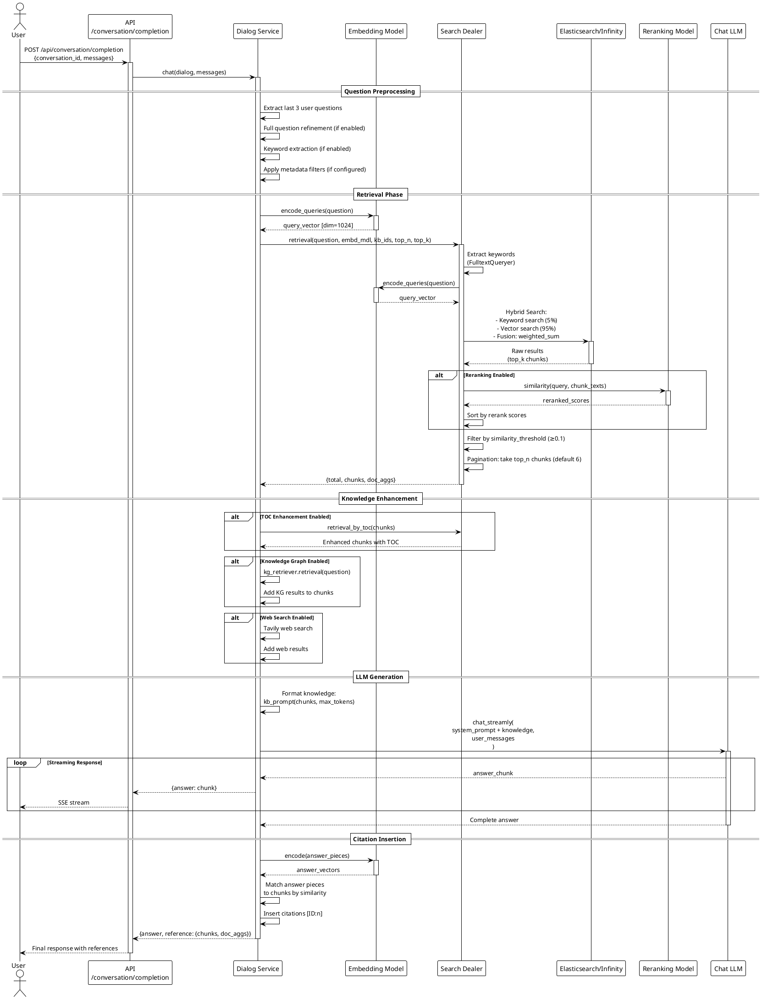

# Luồng Retrieval (Truy Xuất Tài Liệu) trong RAGFlow

## Tổng Quan

Retrieval (truy xuất) là thành phần cốt lõi của RAGFlow, chịu trách nhiệm tìm kiếm và trả về các đoạn văn bản (chunks) có liên quan nhất từ knowledge base để trả lời câu hỏi của người dùng. Hệ thống sử dụng kỹ thuật **Hybrid Search** kết hợp tìm kiếm từ khóa (keyword search) và tìm kiếm vector (vector similarity) để đạt hiệu quả tốt nhất.

## Kiến Trúc Tổng Thể

```plantuml
@startuml
!theme plain

skinparam componentStyle rectangle
skinparam backgroundColor white
skinparam component {
    BackgroundColor<<API>> LightSkyBlue
    BackgroundColor<<Service>> LightGreen
    BackgroundColor<<Engine>> LightCoral
    BackgroundColor<<Model>> LightYellow
}

package "API Layer" {
    [Dialog API] <<API>>
    [Conversation API] <<API>>
    [KB API] <<API>>
}

package "Service Layer" {
    [Dialog Service] <<Service>>
    [Document Service] <<Service>>
    [Conversation Service] <<Service>>
}

package "RAG Engine" {
    [Search Dealer] <<Engine>>
    [KG Search] <<Engine>>
    [FulltextQueryer] <<Engine>>
}

package "Models" {
    [Embedding Model] <<Model>>
    [Reranking Model] <<Model>>
    [Chat LLM] <<Model>>
}

package "Storage" {
    database "Elasticsearch\n/Infinity" as SearchDB
    database "MySQL" as DB
    database "MinIO" as Storage
}

[Conversation API] --> [Dialog Service]
[Dialog API] --> [Dialog Service]
[Dialog Service] --> [Search Dealer]
[Dialog Service] --> [Embedding Model]
[Dialog Service] --> [Reranking Model]
[Dialog Service] --> [Chat LLM]
[Search Dealer] --> [FulltextQueryer]
[Search Dealer] --> SearchDB
[Dialog Service] --> [KG Search]
[KG Search] --> SearchDB
[Document Service] --> SearchDB
[Dialog Service] --> DB

@enduml
```

## Luồng Xử Lý Chi Tiết

### 1. Sequence Diagram - Luồng Hoàn Chỉnh



### 2. Activity Diagram - Chi Tiết Bước Retrieval

```plantuml
@startuml
!theme plain
start

:User submits query;

partition "Preprocessing" {
    :Extract last 3 user questions;

    if (Full question enabled?) then (yes)
        :Refine question with context;
    endif

    if (Cross-language enabled?) then (yes)
        :Translate to English;
    endif

    if (Keyword extraction enabled?) then (yes)
        :Extract keywords via LLM;
        :Append keywords to query;
    endif

    if (Metadata filter configured?) then (yes)
        if (Auto mode?) then (yes)
            :Generate filters via LLM;
        else (manual)
            :Use predefined filters;
        endif
    endif
}

partition "Retrieval" {
    :Encode query to vector\n(Embedding Model);

    fork
        :Keyword Search\n(FulltextQueryer);
    fork again
        :Vector Search\n(Cosine Similarity);
    end fork

    :Fusion: weighted_sum\n(0.05 * keyword + 0.95 * vector);

    :Execute search on\nElasticsearch/Infinity;

    :Get top_k chunks\n(default: retrieve enough for 1024 tokens);

    if (Reranking model configured?) then (yes)
        :Extract chunk texts;
        :Call reranking model;
        :Get similarity scores;
        :Sort by rerank scores;
    else (no)
        :Calculate hybrid similarity:\n0.3*vector + 0.7*keyword + rank_features;
        :Sort by hybrid scores;
    endif

    :Filter: similarity_threshold ≥ 0.1;

    :Pagination: take top_n chunks\n(default: 6);
}

partition "Enhancement" {
    if (TOC enhancement?) then (yes)
        :Retrieve additional chunks\nfrom table of contents;
    endif

    if (Knowledge Graph enabled?) then (yes)
        :Query knowledge graph;
        :Add graph results;
    endif

    if (Web search enabled?) then (yes)
        :Query Tavily API;
        :Add web results;
    endif
}

partition "Generation" {
    :Format chunks for LLM context\n(kb_prompt);

    :Construct system prompt:\n"Use the following knowledge: {chunks}";

    :Stream LLM response;

    :Complete answer received;
}

partition "Citation" {
    :Split answer into pieces;

    :Embed answer pieces;

    :Match pieces to chunks\nby vector similarity;

    :Insert citations [ID:n]\ninto answer;

    :Format references:\n{doc_id, chunk_id, content, similarity};
}

:Return answer + references;

stop
@enduml
```



## Các Thành Phần Chính

### 1. API Endpoints

#### POST `/api/conversation/completion`
**File:** `api/apps/conversation_app.py:166`

Request body:
```json
{
  "conversation_id": "conv_123",
  "messages": [
    {"role": "user", "content": "What is RAG?"}
  ]
}
```

Response (SSE stream):
```json
{"code": 0, "data": {"answer": "RAG stands for...", "reference": {...}}}
```

#### POST `/api/dialog/set`
**File:** `api/apps/dialog_app.py`

Cấu hình retrieval parameters:
```json
{
  "kb_ids": ["kb1", "kb2"],
  "top_n": 6,
  "top_k": 1024,
  "similarity_threshold": 0.1,
  "vector_similarity_weight": 0.3,
  "rerank_id": "jina-reranker-v2"
}
```

### 2. Dialog Service - Core Retrieval Logic

**File:** `api/db/services/dialog_service.py:343`

#### Hàm `chat()` - Luồng Chính

```python
def chat(dialog, messages, stream=True, **kwargs):
    """
    Main function xử lý retrieval và generation

    Args:
        dialog: Dialog object với retrieval config
        messages: Conversation history
        stream: Enable streaming response

    Returns:
        Generator yielding {answer, reference}
    """

    # 1. Load models
    kbs, embd_mdl, rerank_mdl, chat_mdl, tts_mdl = get_models(dialog)

    # 2. Extract questions (last 3 user messages)
    questions = [m["content"] for m in messages if m["role"] == "user"][-3:]

    # 3. Question preprocessing
    if dialog.meta_data_filter:
        # Apply metadata filters
        pass

    # 4. RETRIEVAL - Core logic
    kbinfos = retriever.retrieval(
        question=" ".join(questions),
        embd_mdl=embd_mdl,
        tenant_ids=tenant_ids,
        kb_ids=dialog.kb_ids,
        page=1,
        page_size=dialog.top_n,      # Default: 6 chunks
        similarity_threshold=dialog.similarity_threshold,  # Default: 0.1
        vector_similarity_weight=dialog.vector_similarity_weight,  # Default: 0.3
        doc_ids=attachments,
        top=dialog.top_k,            # Default: 1024 tokens
        aggs=False,
        rerank_mdl=rerank_mdl,
        rank_feature=label_question(" ".join(questions), kbs)
    )

    # 5. Knowledge enhancement
    if prompt_config.get("toc_enhance"):
        # TOC enhancement
        pass

    if prompt_config.get("use_kg"):
        # Knowledge graph
        pass

    # 6. Format knowledge for LLM
    knowledges = kb_prompt(kbinfos, max_tokens=dialog.top_k)

    # 7. LLM generation
    prompt = get_prompt(dialog)
    msg = [{"role": "system", "content": prompt.format(knowledge="\n".join(knowledges))}]
    msg.extend(messages)

    for ans in chat_mdl.chat_streamly(prompt, msg):
        yield {"answer": ans, "reference": {}}

    # 8. Citation insertion
    answer, idx = retriever.insert_citations(answer, chunks, vectors, embd_mdl)

    yield {"answer": answer, "reference": format_references(kbinfos, idx)}
```

### 3. Search Dealer - Hybrid Search Engine

**File:** `rag/nlp/search.py:73-150`

#### Class `Dealer` - Main Retrieval Handler

```python
class Dealer:
    def __init__(self, dataStore):
        self.dataStore = dataStore  # Elasticsearch or Infinity connection
        self.qryr = FulltextQueryer()

    def retrieval(self, question, embd_mdl, tenant_ids, kb_ids,
                  page=1, page_size=30, similarity_threshold=0.1,
                  vector_similarity_weight=0.3, top=1024,
                  doc_ids=None, rerank_mdl=None, rank_feature=None,
                  aggs=True, **kwargs):
        """
        Main retrieval function

        Returns:
            {
                "total": int,
                "chunks": [{chunk_id, content_with_weight, similarity, ...}],
                "doc_aggs": {doc_id: doc_info}
            }
        """

        # 1. Build search request
        req = {
            "knowledge_graph_kwd": knowledge_graph_kwd,
            "doc_ids": doc_ids,
            "size": top * 3,  # Fetch more for reranking
        }

        # 2. Search
        sres = self.search(
            req=req,
            search_on_knowledge_graph=False,
            idx_names=None,
            kb_ids=kb_ids,
            emb_mdl=embd_mdl,
            highlight=True
        )

        # 3. Reranking
        if rerank_mdl and sres.total > 0:
            sim, tsim, vsim = self.rerank_by_model(
                rerank_mdl, sres, question,
                1 - vector_similarity_weight,  # tkweight
                vector_similarity_weight        # vtweight
            )
        else:
            sim, tsim, vsim = self.rerank(
                sres, question,
                tkweight=1 - vector_similarity_weight,
                vtweight=vector_similarity_weight,
                rank_feature=rank_fea
            )

        # 4. Filter by threshold
        idx = [i for i, s in enumerate(sim) if s >= similarity_threshold]

        # 5. Sort and paginate
        idx = sorted(idx, key=lambda i: sim[i], reverse=True)
        s, e = (page - 1) * page_size, page * page_size
        ranks = idx[s:e]

        # 6. Format results
        chunks = []
        for i in ranks:
            chunk = sres.field[sres.ids[i]]
            chunk["similarity"] = sim[i]
            chunks.append(chunk)

        return {
            "total": len(idx),
            "chunks": chunks,
            "doc_aggs": doc_aggs if aggs else {}
        }
```

#### Hybrid Search Logic

```python
def search(self, req, idx_names, kb_ids, emb_mdl=None, ...):
    """
    Hybrid search: keyword + vector
    """

    # 1. Keyword search (FulltextQueryer)
    matchText, keywords = self.qryr.question(
        qst,
        min_match=0.3,
        topn=5  # Top 5 keywords
    )

    # 2. Vector search
    if emb_mdl:
        # Encode query
        qv, _ = emb_mdl.encode_queries(qst)
        embedding_data = [float(v) for v in qv]

        # Create vector match expression
        matchDense = MatchDenseExpr(
            vector_column_name=f"q_{len(embedding_data)}_vec",
            embedding_data=embedding_data,
            embedding_data_type='float',
            distance_type='cosine',
            topn=topk,
            opt_params={"similarity": similarity}
        )

        # 3. Fusion: 0.05*keyword + 0.95*vector
        fusionExpr = FusionExpr(
            method="weighted_sum",
            topn=topk,
            opt_params={"weights": "0.05,0.95"}
        )

        matchExprs = [matchText, matchDense, fusionExpr]
    else:
        matchExprs = [matchText]

    # 4. Execute search
    res = self.dataStore.search(
        select_fields=src,
        highlight_fields=highlightFields,
        filter_conditions=filters,
        match_exprs=matchExprs,
        order_by=orderBy,
        offset=offset,
        limit=limit,
        index_names=idx_names,
        kb_ids=kb_ids
    )

    return res
```

### 4. Embedding Models

**File:** `rag/llm/embedding_model.py`

#### Supported Models

```python
class BuiltinEmbed(Base):
    MAX_TOKENS = {
        "Qwen/Qwen3-Embedding-0.6B": 30000,
        "BAAI/bge-m3": 8000,
        "BAAI/bge-small-en-v1.5": 500,
        "BAAI/bge-small-zh-v1.5": 500,
        "BAAI/bge-base-zh-v1.5": 500,
        "BAAI/bge-large-zh-v1.5": 500,
        "sentence-transformers/all-MiniLM-L6-v2": 500
    }

    def encode(self, texts: list, batch_size=16):
        """Encode documents to vectors"""
        token_count = sum([count_tokens(t) for t in texts])

        res = []
        for i in range(0, len(texts), batch_size):
            batch = texts[i:i+batch_size]
            embeddings = self.model.encode(
                batch,
                normalize_embeddings=True
            )
            res.extend(embeddings.tolist())

        return np.array(res), token_count

    def encode_queries(self, text: str):
        """Encode query to vector"""
        emb, cnt = self.encode([text])
        return emb[0], cnt
```

### 5. Reranking Models

**File:** `rag/llm/rerank_model.py`

#### Interface

```python
class Base(ABC):
    def __init__(self, model_name):
        self.model_name = model_name

    @abstractmethod
    def similarity(self, query: str, texts: list):
        """
        Calculate similarity scores

        Returns:
            scores: list[float]
            token_count: int
        """
        raise NotImplementedError()
```

#### Jina Rerank Implementation

```python
class JinaRerank(Base):
    def similarity(self, query: str, texts: list):
        # Call Jina rerank API
        response = requests.post(
            "https://api.jina.ai/v1/rerank",
            headers={"Authorization": f"Bearer {api_key}"},
            json={
                "model": self.model_name,
                "query": query,
                "documents": texts,
                "top_n": len(texts)
            }
        )

        results = response.json()["results"]
        scores = [r["relevance_score"] for r in results]

        return scores, token_count
```

#### Reranking Logic

**File:** `rag/nlp/search.py:290-350`

```python
def rerank_by_model(self, rerank_mdl, sres, query, tkweight=0.3, vtweight=0.7):
    """
    Rerank using external reranking model
    """

    # 1. Extract texts from chunks
    texts = []
    for chunk_id in sres.ids:
        content = sres.field[chunk_id]["content_ltks"]
        title_tks = sres.field[chunk_id].get("title_tks", "")
        important_kwd = sres.field[chunk_id].get("important_kwd", [])

        # Combine content + title + keywords
        tks = content.split() + title_tks.split() + important_kwd
        texts.append(" ".join(tks))

    # 2. Get rerank scores
    vtsim, _ = rerank_mdl.similarity(query, texts)

    # 3. Get keyword similarity (from search results)
    tksim = [sres.field[id].get("_score", 0.0) for id in sres.ids]

    # 4. Hybrid score: tkweight*keyword + vtweight*rerank
    sim = [tkweight * ts + vtweight * vs for ts, vs in zip(tksim, vtsim)]

    return sim, tksim, vtsim

def rerank(self, sres, query, tkweight=0.3, vtweight=0.7, rank_feature=None):
    """
    Default reranking (no external model)
    Hybrid: keyword + vector + rank_features
    """

    # 1. Keyword similarity (from Elasticsearch)
    tksim = [sres.field[id].get("_score", 0.0) for id in sres.ids]

    # 2. Vector similarity (from Elasticsearch)
    vsim = [sres.field[id].get("vector_score", 0.0) for id in sres.ids]

    # 3. Rank features (tag-based scoring)
    rank_fea = [0.0] * len(sres.ids)
    if rank_feature:
        rank_fea = self._rank_feature_scores(rank_feature, sres)

    # 4. Combine
    sim = [
        tkweight * ts + vtweight * vs + rf
        for ts, vs, rf in zip(tksim, vsim, rank_fea)
    ]

    return sim, tksim, vsim
```

### 6. Document Chunking & Indexing

#### Chunking Process

**File:** `rag/flow/splitter/splitter.py`

```python
class Splitter(ProcessBase):
    async def _invoke(self, **kwargs):
        payload = self.get_input()

        # Get chunking parameters
        chunk_token_size = self._param.chunk_token_size  # Default: 512
        delimiters = self._param.delimiters  # Default: ["\n"]
        overlapped_percent = self._param.overlapped_percent  # Default: 0.0

        # Chunk text
        chunks = naive_merge(
            payload,
            chunk_token_size,
            delimiters,
            overlapped_percent
        )

        self.set_output("chunks", [{"text": c.strip()} for c in chunks])
```

#### Indexing Process

**File:** `rag/svr/task_executor.py`

```python
async def embedding(docs, mdl, parser_config=None, callback=None):
    """Generate embeddings for chunks"""

    # Extract texts
    texts = [truncate(c, max_length) for c in chunks]

    # Batch encode
    vectors, token_count = mdl.encode(texts, batch_size=16)

    # Attach vectors to chunks
    for chunk, vec in zip(chunks, vectors):
        chunk[f"q_{len(vec)}_vec"] = vec.tolist()

    return chunks

async def insert_es(task_id, task_tenant_id, task_dataset_id, chunks, ...):
    """Insert chunks into search engine"""

    # Batch insert (128 chunks per batch)
    for b in range(0, len(chunks), settings.DOC_BULK_SIZE):
        batch = chunks[b:b + settings.DOC_BULK_SIZE]

        settings.docStoreConn.insert(
            docs=batch,
            index_name=search.index_name(task_dataset_id),
            kb_id=task_dataset_id
        )
```

#### Chunk Structure

```python
# Chunk document structure in Elasticsearch/Infinity
chunk_doc = {
    # IDs
    "chunk_id": "chunk_abc123",
    "doc_id": "doc_xyz789",
    "kb_id": "kb_001",

    # Content
    "content_ltks": "tokenized content...",  # For keyword search
    "content_with_weight": "raw content...",  # Original text

    # Metadata
    "docnm_kwd": "document_name.pdf",
    "doc_type_kwd": "pdf",
    "page_num_int": 5,
    "position_int": [100, 200, 300, 400],  # [x1, y1, x2, y2]
    "create_timestamp_flt": 1700000000.0,
    "available_int": 1,  # Status flag

    # Search enhancement
    "title_tks": "Section Title",
    "important_kwd": ["keyword1", "keyword2"],
    "question_kwd": ["Q: What is..."],
    "question_tks": "tokenized questions",

    # Vector embeddings (dimension varies by model)
    "q_1024_vec": [0.123, -0.456, ...],  # 1024-dim vector

    # Advanced features
    "tag_kwd": ["tag1", "tag2"],
    "knowledge_graph_kwd": "entity1|relation|entity2",
    "raptor_kwd": "hierarchical summary",
    "toc_kwd": "table of contents info"
}
```

### 7. Citation Insertion

**File:** `rag/nlp/search.py:520-600`

```python
def insert_citations(self, answer, chunks, vectors, embd_mdl):
    """
    Insert citations into answer text

    Args:
        answer: Generated answer text
        chunks: Retrieved chunks
        vectors: Chunk vectors
        embd_mdl: Embedding model

    Returns:
        answer_with_citations: str
        used_chunk_indices: list[int]
    """

    # 1. Split answer into pieces (by sentences)
    pieces = split_answer_into_pieces(answer)

    # 2. Encode answer pieces
    piece_vectors, _ = embd_mdl.encode(pieces)

    # 3. Match pieces to chunks by similarity
    citations = []
    for i, piece_vec in enumerate(piece_vectors):
        # Calculate cosine similarity with all chunks
        similarities = [
            cosine_similarity(piece_vec, chunk_vec)
            for chunk_vec in vectors
        ]

        # Get best matching chunk
        best_chunk_idx = np.argmax(similarities)
        max_sim = similarities[best_chunk_idx]

        # Only cite if similarity > threshold (0.6)
        if max_sim > 0.6:
            citations.append({
                "piece_idx": i,
                "chunk_idx": best_chunk_idx,
                "similarity": max_sim
            })

    # 4. Insert [ID:n] citations into answer
    answer_with_citations = insert_citation_markers(answer, citations)

    # 5. Get unique chunk indices used
    used_indices = list(set([c["chunk_idx"] for c in citations]))

    return answer_with_citations, used_indices
```

## Cấu Hình Chi Tiết

### Dialog Configuration

```python
# Dialog model fields (api/db/db_models.py)
class Dialog(models.Model):
    # Basic info
    id = models.CharField(primary_key=True)
    name = models.CharField()
    description = models.CharField(null=True)
    tenant_id = models.CharField()

    # Retrieval parameters
    kb_ids = ArrayField(default=[])  # Knowledge base IDs
    top_n = models.IntegerField(default=6)  # Chunks to return
    top_k = models.IntegerField(default=1024)  # Max tokens to fetch
    similarity_threshold = models.FloatField(default=0.1)  # Min similarity
    vector_similarity_weight = models.FloatField(default=0.3)  # Vector weight

    # Models
    llm_id = models.CharField()  # Chat model
    rerank_id = models.CharField(null=True)  # Rerank model

    # Advanced settings
    prompt = models.TextField()  # System prompt template
    meta_data_filter = models.JSONField(null=True)  # Metadata filters
    prompt_config = models.JSONField(default={})  # TOC, KG, web search flags
```

### Retrieval Parameters

```python
# Default values
RETRIEVAL_DEFAULTS = {
    # Search
    "top_n": 6,                    # Number of chunks returned
    "top_k": 1024,                 # Max tokens to fetch from search
    "similarity_threshold": 0.1,    # Minimum similarity score [0, 1]

    # Hybrid search weights
    "vector_similarity_weight": 0.3,  # 0.3*vector + 0.7*keyword
    "keyword_weight": 0.7,             # Calculated as 1 - vector_weight

    # Search engine fusion
    "keyword_search_weight": 0.05,  # 5% keyword in fusion
    "vector_search_weight": 0.95,   # 95% vector in fusion

    # Reranking
    "rerank_id": None,  # Optional: "jina-reranker-v2", "bge-reranker-base"

    # Advanced
    "meta_data_filter": None,  # Optional metadata filtering
    "doc_ids": None,           # Optional: restrict to specific documents
}

# Metadata filter structure
meta_data_filter = {
    "method": "auto",  # "auto" or "manual"
    "logic": "and",    # "and" or "or"
    "conditions": [
        {
            "name": "field_name",           # Field to filter on
            "comparison_operator": "is",     # "is", "contains", ">", "<", "="
            "value": "expected_value"
        }
    ]
}

# Prompt config flags
prompt_config = {
    "keyword": False,        # Extract keywords from query
    "toc_enhance": False,    # Use table of contents enhancement
    "use_kg": False,         # Include knowledge graph results
    "web_search": False,     # Add Tavily web search
    "full_question": False   # Refine question with conversation context
}
```

### Chunking Parameters

```python
# Document parsing and chunking config
CHUNKING_DEFAULTS = {
    # Chunk size
    "chunk_token_size": 512,      # Tokens per chunk
    "chunk_token_num": 128,       # Alternative: fixed token count

    # Delimiters
    "delimiters": ["\n"],         # Split on newlines
    # Alternative delimiters:
    # - ["\n", ".", "!", "?"]    # Split on sentences
    # - ["\n\n"]                  # Split on paragraphs
    # - ["##"]                    # Split on markdown headers

    # Overlap
    "overlapped_percent": 0.0,    # 0-1, percentage of overlap between chunks

    # Layout analysis (for PDFs)
    "layout_recognize": True,     # Use vision model for layout
    "task_page_size": 12,         # Pages to process at once
}
```

### Search Engine Configuration

```python
# docker/.env
DOC_ENGINE=elasticsearch  # or "infinity", "opensearch"

# Elasticsearch settings
ES_HOST=http://es01:9200
ES_USER=elastic
ES_PASSWORD=infini_rag_flow

# Infinity settings (alternative)
INFINITY_HOST=infinity
INFINITY_PORT=23820

# Index configuration
INDEX_NAME_TEMPLATE = "ragflow_{kb_id}"
SHARDS = 1
REPLICAS = 0
MAX_RESULT_WINDOW = 10000
```

## Các Trường Hợp Sử Dụng

### Case 1: Basic Retrieval

```python
# Minimal configuration
dialog = {
    "kb_ids": ["kb_001"],
    "top_n": 6,
    "similarity_threshold": 0.1
}

# Query
question = "What is RAG?"

# Result
{
    "answer": "RAG (Retrieval-Augmented Generation) is...[ID:0][ID:1]",
    "reference": {
        "chunks": [
            {
                "id": 0,
                "doc_id": "doc_123",
                "content": "RAG combines retrieval and generation...",
                "similarity": 0.85
            },
            {
                "id": 1,
                "doc_id": "doc_456",
                "content": "The retrieval component searches...",
                "similarity": 0.78
            }
        ],
        "doc_aggs": {
            "doc_123": {"name": "rag_overview.pdf", "chunk_count": 2},
            "doc_456": {"name": "retrieval_guide.pdf", "chunk_count": 1}
        }
    }
}
```

### Case 2: Advanced Retrieval with Reranking

```python
# Advanced configuration
dialog = {
    "kb_ids": ["kb_001", "kb_002"],
    "top_n": 10,
    "top_k": 2048,
    "similarity_threshold": 0.2,
    "vector_similarity_weight": 0.5,
    "rerank_id": "jina-reranker-v2",
    "meta_data_filter": {
        "method": "manual",
        "logic": "and",
        "conditions": [
            {"name": "doc_type_kwd", "comparison_operator": "is", "value": "pdf"},
            {"name": "create_timestamp_flt", "comparison_operator": ">", "value": "1700000000"}
        ]
    },
    "prompt_config": {
        "toc_enhance": True,
        "use_kg": True
    }
}
```

### Case 3: Search API (Direct Retrieval)

```python
# POST /api/conversation/ask
{
    "question": "Explain deep learning",
    "kb_ids": ["kb_ml"],
    "similarity_threshold": 0.15,
    "vector_similarity_weight": 0.4,
    "top_n": 8
}

# Response
{
    "code": 0,
    "data": {
        "chunks": [...],
        "doc_aggs": {...},
        "total": 8
    }
}
```

## Performance Optimization

### 1. Index Optimization

```python
# Elasticsearch index settings
{
    "settings": {
        "number_of_shards": 1,
        "number_of_replicas": 0,
        "refresh_interval": "1s",
        "max_result_window": 10000
    },
    "mappings": {
        "properties": {
            "content_ltks": {"type": "text"},
            "q_1024_vec": {
                "type": "dense_vector",
                "dims": 1024,
                "index": true,
                "similarity": "cosine"
            }
        }
    }
}
```

### 2. Batch Processing

```python
# Embedding batch size
EMBEDDING_BATCH_SIZE = 16

# Indexing batch size
DOC_BULK_SIZE = 128

# Search batch size
SEARCH_TOP_K = 1024  # Fetch in bulk, then rerank
```

### 3. Caching

```python
# Model caching
LLM_MODEL_CACHE = {}
EMBEDDING_MODEL_CACHE = {}

# Query caching (Redis)
CACHE_EXPIRY = 3600  # 1 hour
```

## Monitoring & Debugging

### Key Metrics

```python
# Retrieval metrics
{
    "search_latency_ms": 50,          # Search engine query time
    "embedding_latency_ms": 20,       # Query encoding time
    "rerank_latency_ms": 100,         # Reranking time
    "total_retrieval_latency_ms": 170,

    "chunks_fetched": 30,             # Initial search results
    "chunks_after_filter": 15,        # After similarity filter
    "chunks_returned": 6,             # Final top_n

    "avg_chunk_similarity": 0.65,     # Average similarity score
    "max_chunk_similarity": 0.92,
    "min_chunk_similarity": 0.23
}
```

### Logging

```python
# Enable retrieval logging
import logging

logging.basicConfig(level=logging.DEBUG)
logger = logging.getLogger("rag.retrieval")

# Log format
logger.debug(f"Retrieval: query='{question}', kb_ids={kb_ids}, top_n={top_n}")
logger.debug(f"Search results: {sres.total} chunks found")
logger.debug(f"After reranking: {len(filtered)} chunks above threshold")
logger.debug(f"Returning {len(final_chunks)} chunks")
```

## Troubleshooting

### Common Issues

#### 1. No Results Returned

```python
# Check:
# - similarity_threshold too high (try 0.0)
# - kb_ids incorrect
# - Documents not indexed properly
# - Embedding model mismatch

# Debug query
retrieval_result = retriever.retrieval(
    question,
    embd_mdl,
    ...,
    similarity_threshold=0.0  # Remove threshold temporarily
)
print(f"Total results: {retrieval_result['total']}")
print(f"Top similarity: {retrieval_result['chunks'][0]['similarity']}")
```

#### 2. Irrelevant Results

```python
# Solutions:
# - Increase similarity_threshold (0.1 → 0.3)
# - Adjust vector_similarity_weight (0.3 → 0.7)
# - Enable reranking
# - Improve chunk quality (better parsing, metadata)
# - Use metadata filters

dialog.similarity_threshold = 0.3
dialog.vector_similarity_weight = 0.7
dialog.rerank_id = "jina-reranker-v2"
```

#### 3. Slow Retrieval

```python
# Optimizations:
# - Reduce top_k (1024 → 512)
# - Reduce top_n (6 → 3)
# - Disable unnecessary features (TOC, KG, web search)
# - Use faster embedding model
# - Optimize Elasticsearch/Infinity

dialog.top_k = 512
dialog.top_n = 3
dialog.prompt_config = {
    "toc_enhance": False,
    "use_kg": False,
    "web_search": False
}
```

## Tài Liệu Tham Khảo

### Code Files

| Component | File Path | Description |
|-----------|-----------|-------------|
| API Endpoints | `api/apps/conversation_app.py` | Conversation/chat endpoints |
| | `api/apps/dialog_app.py` | Dialog configuration endpoints |
| Core Retrieval | `api/db/services/dialog_service.py` | Main retrieval logic |
| Search Engine | `rag/nlp/search.py` | Hybrid search implementation |
| Embedding | `rag/llm/embedding_model.py` | Embedding model interfaces |
| Reranking | `rag/llm/rerank_model.py` | Reranking model interfaces |
| Chunking | `rag/flow/splitter/splitter.py` | Document chunking logic |
| Indexing | `rag/svr/task_executor.py` | Document indexing pipeline |
| Connections | `rag/utils/es_conn.py` | Elasticsearch connection |
| | `rag/utils/infinity_conn.py` | Infinity connection |
| Models | `api/db/db_models.py` | Database models |
| Settings | `common/settings.py` | Global configuration |

### Configuration Files

- `docker/.env` - Environment variables
- `docker/service_conf.yaml.template` - Service configuration
- `pyproject.toml` - Python dependencies

### External Resources

- Elasticsearch Documentation: https://www.elastic.co/guide/
- Infinity Vector Database: https://github.com/infiniflow/infinity
- Jina Reranker API: https://jina.ai/reranker/
- BGE Models: https://huggingface.co/BAAI

---

**Tác giả**: RAGFlow Team
**Phiên bản**: 1.0.0
**Cập nhật**: 2025-11-25
